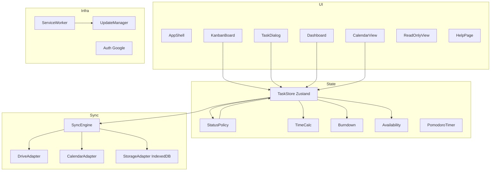
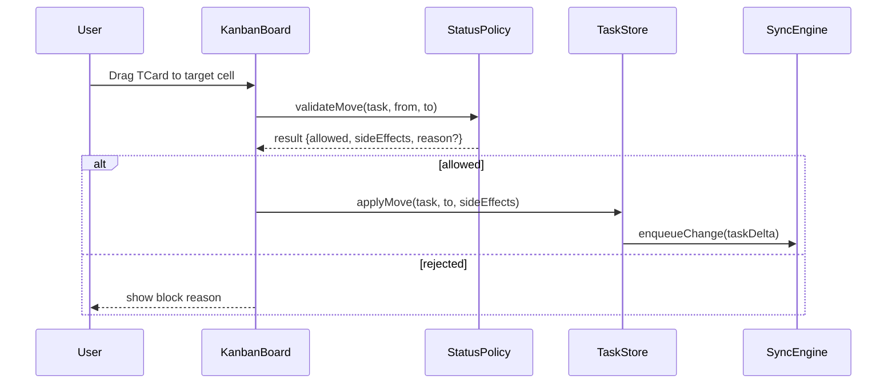
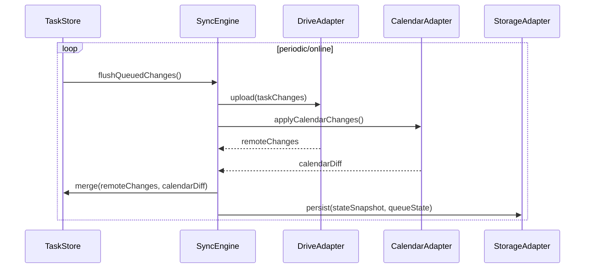
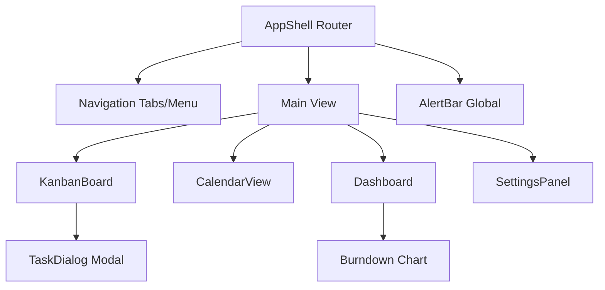

# Design Document

---
**Purpose**: 要件を満たすためのアーキテクチャとインターフェースを定義し、実装ブレを防ぐ。
---

## Overview
学習計画カンバン（LPK）はブラウザ完結の PWA として、教科×ステータスの固定グリッド上でタスクを運用し、オフラインでも編集・計測・同期を継続する。Google Drive を主ストレージ、Google Calendar を予定連携に用い、週次スプリントの計画と日次運用、週次レビューを一貫して支援する。

### Goals
- 固定ステータス列と教科行による2次元カンバンで、ドラッグ操作とダイアログ編集を安全に提供する。
- オフラインファーストのローカルストアと同期エンジンで、Google Drive/Calendar への双方向同期を実現する。
- 時間管理（予定/残り時間、PT、自動計測）と Today 過負荷警告を一貫したロジックで提供する。

### Non-Goals
- バックエンドサーバの新規構築（GitHub Pages 配信のみ）。
- RSC/SSR ベースの UI ランタイム（必要なら別途検討）。
- AI 自動スケジューリングなど要件外の高度機能。

## Architecture

### Existing Architecture Analysis
新規実装（既存コードなし）。ステアリングのスタック方針（React + Vite + TanStack Router + Zustand、PWA、Google API）を前提に設計する。

### Architecture Pattern & Boundary Map
採用: クライアントサイド Clean（Ports/Adapters）＋ローカルストア／同期キュー分離。



### Technology Stack

| Layer | Choice / Version | Role in Feature | Notes |
|-------|------------------|-----------------|-------|
| Frontend | React 18 + Vite | SPA/PWA UI 実行基盤 | Vite で高速 dev/build、PWA プラグイン想定 |
| State | Zustand | グローバル状態とローカルキャッシュ | ミドル状態を hooks で提供 |
| Routing | TanStack Router | 画面遷移（カンバン/カレンダー/ヘルプ/閲覧専用） | 型安全ルーティング |
| UI | MUI + dnd-kit | コンポーネントと DnD | アクセシビリティ対応前提 |
| Data Store | IndexedDB | オフライン永続と変更キュー保持 | StorageAdapter で抽象化 |
| Sync | Google Drive API / Google Calendar API | 主データ／予定の双方向同期 | Drive は JSON ファイル、Calendar は syncToken 差分 |
| PWA | Service Worker + @vite-pwa/plugin | オフラインキャッシュと強制アップデート | 非モーダル通知で更新 |
| Testing | Vitest + RTL + MSW + Playwright | 単体/統合/E2E | Steering/testing に準拠 |

## System Flows

### タスク移動（DnD）とステータス遷移ガード

Key: ポリシーは Today→InPro 制約、Done 遷移条件、InPro 唯一性、自動 OnHold を返す。

### オフライン同期サイクル（Drive/Calendar）

Key: syncToken 失効時はフル再取得、競合時は保守的マージ＋ユーザー通知。

### UI 階層構造（コンテナと主要画面）


## Requirements Traceability

| Requirement | Summary | Components | Interfaces | Flows |
|-------------|---------|------------|------------|-------|
| 1.1 | 固定ステータス列と教科行でボード構成 | KanbanBoard, TaskStore | StatusPolicy | タスク移動 |
| 1.2 | スプリント1週固定で開始/終了日表示 | SprintSelector, Dashboard | TaskStore | - |
| 1.3 | 初期表示はカンバンのみ | AppShell, KanbanBoard | Router | - |
| 1.4 | ステータス列ロック | KanbanBoard | StatusPolicy | タスク移動 |
| 1.5 | ステータス表示名設定のみ許可 | SettingsStore | Settings API | - |
| 1.6 | 教科順変更をスプリント単位保存 | TaskStore | StorageAdapter | - |
| 1.7 | タスクある教科は削除不可 | TaskStore | StatusPolicy | - |
| 1.8 | Backlog プラスで作成ダイアログ | KanbanBoard, TaskDialog | - | - |
| 1.9 | 空セルドラッグでスクロール＆ヘッダー固定 | KanbanBoard | - | - |
| 2.1 | 新規 TDialog で全属性入力保存 | TaskDialog | TaskStore | - |
| 2.2 | 既存 Task 読込編集保存 | TaskDialog | TaskStore | - |
| 2.3 | TCard にタイトル/期日/予定/残り/ゲージ | TaskCard | TimeCalc | - |
| 2.4 | ダイアログでタイトルに初期フォーカス | TaskDialog | - | - |
| 2.5 | Tab 移動 | TaskDialog | - | - |
| 2.6 | 保存: Ctrl+Enter/ボタン, Esc/キャンセル | TaskDialog | - | - |
| 2.7 | 保存/キャンセル/消去操作 | TaskDialog | TaskStore | - |
| 2.8 | 日付別実績累積表示 | TaskDialog | TimeCalc | - |
| 2.9 | 実績の手動修正許可 | TaskDialog | TaskStore | - |
| 3.1 | ステータス/教科間ドラッグで移動保存 | KanbanBoard, TaskStore | StatusPolicy | タスク移動 |
| 3.2 | ドラッグ中に有効セルをハイライト | KanbanBoard | StatusPolicy | タスク移動 |
| 3.3 | セル内優先度順ソート | KanbanBoard | PrioritySorter | - |
| 3.4 | セル内並び替えを保存 | TaskStore | StorageAdapter | - |
| 3.5 | マウス/タッチ両方サポート | KanbanBoard | DnD API | - |
| 3.6 | TCard 横長、InPro 正方形 | TaskCard | - | - |
| 3.7 | InPro は常に1件で積み上げなし | StatusPolicy, TaskCard | - | タスク移動 |
| 3.8 | Today 最優先以外→InPro 禁止 | StatusPolicy | - | タスク移動 |
| 3.9 | InPro のみ1件、他は OnHold へ自動移動 | StatusPolicy, TaskStore | - | タスク移動 |
| 3.10 | InPro/OnHold 以外→Done 禁止 | StatusPolicy | - | タスク移動 |
| 3.11 | Today/InPro/OnHold 残り時間超過で警告 | AlertBar, Availability, TimeCalc | - | - |
| 3.12 | InPro 自動計測＋円形インジケータ | PomodoroTimer, TaskCard | TimeCalc | - |
| 3.13 | PT 操作と通知 | PomodoroTimer, AlertBar | - | - |
| 3.14 | PT 終了時アラーム | PomodoroTimer, AlertBar | - | - |
| 4.1 | Dashboard で週次集計とバージョン表示 | Dashboard | Burndown, UpdateManager | - |
| 4.2 | 今日期日 Backlog 強調 | KanbanBoard | TimeCalc | - |
| 4.3 | 期日超過フラグ/リスト | Dashboard | TimeCalc | - |
| 4.4 | バーンダウンチャート | Dashboard | Burndown | - |
| 4.5 | 月曜始まりカレンダー選択 | CalendarView | Router | カレンダーフロー |
| 4.6 | Calendar 予定取得し表示（学習可能時間は自動反映しない） | CalendarView | CalendarAdapter, Availability | カレンダーフロー |
| 4.7 | LPK カレンダー更新を Google Calendar に反映 | CalendarView | CalendarAdapter | カレンダーフロー |
| 4.8 | 特定日ビューで3種のタスク一覧 | CalendarView | TaskStore | - |
| 4.9 | 曜日ごとの作業可能時間デフォルト | Availability | SettingsStore | - |
| 4.10 | 特定日上書き | Availability | TaskStore | - |
| 4.11 | 予定を表示して学習可能時間調整の参考にする（自動反映なし） | Availability | CalendarAdapter | カレンダーフロー |
| 4.12 | 当日の予定と、手入力の学習可能時間に基づく残り学習可能時間ゲージ表示 | KanbanBoard | Availability, TimeCalc | - |
| 4.13 | 教科別完了数/時間の週次サマリ | Dashboard | Burndown, TimeCalc | - |
| 4.14 | 当日追加タスクのみ表示 | CalendarView | TaskStore | - |
| 4.15 | ヘルプページ提供 | HelpPage | - | - |
| 4.16 | 予定/実績時間グラフ表示 | CalendarView | TimeCalc | - |
| 5.1 | PWA インストール、主要ブラウザ対応 | AppShell, ServiceWorker | UpdateManager | - |
| 5.2 | GitHub Pages 配信 | Build/Hosting | - | - |
| 5.3 | Google サインインで Drive 保存 | Auth, DriveAdapter | SyncEngine | - |
| 5.4 | オンライン時ローカルキャッシュ＋随時/定期同期 | TaskStore, SyncEngine | StorageAdapter | 同期フロー |
| 5.5 | オフライン操作と再接続同期 | TaskStore, SyncEngine | StorageAdapter | 同期フロー |
| 5.6 | 同期状態の非モーダル通知と再試行 | AlertBar, SyncEngine | - | 同期フロー |
| 5.7 | サーバレス構成（Pages＋Drive） | Architecture | - | - |
| 5.8 | バージョンチェックと自動アップデート | UpdateManager | ServiceWorker | 更新フロー |
| 5.9 | 強制アップデート | UpdateManager | ServiceWorker | 更新フロー |
| 5.10 | Drive 複数ファイルは専用ディレクトリ | DriveAdapter | - | - |
| 5.11 | 将来の API 拡張性 | SyncEngine, TaskStore | Ports | - |
| 5.12 | gh スクリプトで保護/マージ方式/Pages 設定 | RepoSetupScript | GitHub API | - |
| 5.13 | データバックアップとローテーション | SyncEngine, DriveAdapter, StorageAdapter | - | - |
| 6.1 | 期日接近リマインド | AlertBar | TimeCalc | - |
| 6.2 | 閲覧専用リンク/権限 | ReadOnlyView, Auth | Router | - |
| 6.3 | 閲覧専用 PWA モード | ReadOnlyView | ServiceWorker | - |
| 6.4 | 閲覧モードの自動更新/オフライン表示 | ReadOnlyView, SyncEngine | StorageAdapter | 同期フロー |
| 6.5 | 招待無効化で閲覧遮断 | Auth, Router | - | - |
| 7.1 | WCAG 2.1 AA 準拠 | 全 UI | A11y API | - |
| 7.2 | キーボードナビゲーション | KanbanBoard, TaskDialog, CalendarView | A11y API | - |
| 7.3 | 適切な ARIA 属性 | 全 UI | A11y API | - |
| 7.4 | 言語切替（JA/EN） | AppShell, i18n | - | - |
| 7.5 | 設定永続 | SettingsStore | StorageAdapter | - |
| 8.1 | main push で自動テスト | CI | - | - |
| 8.2 | テスト成功でビルド | CI | - | - |
| 8.3 | ビルド成功で Pages デプロイ | CI | - | - |
| 8.4 | デプロイ結果通知 | CI | - | - |
| 9.1 | Dev Container で開発環境構築 | DevContainer | - | - |
| 9.2 | 依存関係プリインストール | DevContainer | - | - |
| 9.3 | 推奨拡張自動導入 | DevContainer | - | - |

## Components and Interfaces

### Summary Table
| Component | Domain/Layer | Intent | Req Coverage | Key Dependencies (P0/P1) | Contracts |
|-----------|--------------|--------|--------------|--------------------------|-----------|
| AppShell | UI | ルーティングとシェル、閲覧モード切替 | 1.3,6.2,7.4 | Router (P0), ServiceWorker (P1) | State |
| KanbanBoard | UI | 教科×ステータスグリッドと DnD | 1.x,3.x,4.2,4.12 | StatusPolicy (P0), TaskStore (P0), DnD Kit (P1) | State |
| TaskCard | UI | タスク表示（ゲージ/円形インジケータ） | 2.3,3.6,3.12 | TimeCalc (P0), PomodoroTimer (P1), InProAutoTracker (P0) | State |
| TaskDialog | UI | 作成/編集/消去と入力制御 | 1.8,2.x | TaskStore (P0) | Service |
| Dashboard | UI | 週次集計・バーンダウン | 4.1,4.3,4.4,4.13 | Burndown (P0) | State |
| SettingsPanel | UI | ステータス表示名と言語を設定し、バージョン/アップデート状態と PT デフォルト時間を表示 | 1.5,7.4,5.8,5.9,5.14,3.13 | TaskStore (P0), UpdateManager (P1) | State |
| CalendarView | UI | 月曜始まりカレンダーと予定/学習時間表示 | 4.5-4.16 | CalendarAdapter (P0), Availability (P0) | State |
| HelpPage | UI | 操作説明 | 4.15 | - | - |
| AlertBar | UI | 非モーダル通知（同期/PT/期日） | 3.11,3.13,4.6,5.6,5.8 | SyncEngine (P0), TimeCalc (P0) | State |
| TaskStore | State | タスク/教科/スプリント状態と IndexedDB 永続 | 全般 | StorageAdapter (P0), SyncEngine (P0) | State |
| StatusPolicy | Domain | ステータス遷移ガードと副作用計算 | 1.4,3.x | TaskStore (P1) | Service |
| PrioritySorter | Domain | セル内優先度順序 | 3.3,3.4 | TaskStore (P1) | Service |
| InProAutoTracker | Domain | InPro 滞在中の自動実績反映 | 3.12 | TaskStore (P0) | Service |
| TimeCalc | Domain | 残り時間計算と Today 負荷 | 2.3,3.11,4.2,4.12 | TaskStore (P1) | Service |
| Burndown | Domain | バーンダウン計算と週次サマリ | 4.1,4.4,4.13 | TaskStore (P1) | Service |
| Availability | Domain | 学習可能時間（予定/上書き/曜日）計算 | 4.6,4.9-4.12 | CalendarAdapter (P1), SettingsStore (P1) | Service |
| PomodoroTimer | Domain | PT 計測と通知 | 3.12-3.14 | AlertBar (P1) | Service |
| SyncEngine | Sync | 変更キューと双方向同期 | 5.3-5.6,6.4 | DriveAdapter (P0), CalendarAdapter (P0), StorageAdapter (P0) | Service |
| BackupService | Sync | バックアップ取得・保持・復元 | 5.13 | DriveAdapter (P0), StorageAdapter (P0) | Service |
| DriveAdapter | Integration | Drive API 呼び出し | 5.3,5.10 | Auth (P0) | API |
| CalendarAdapter | Integration | Calendar API 呼び出し | 4.6-4.12 | Auth (P0) | API |
| StorageAdapter | Infra | IndexedDB CRUD | 5.4,5.5 | - | Service |
| UpdateManager | Infra | バージョン検知と強制アップデート | 4.1,5.8,5.9 | ServiceWorker (P0) | Service |
| Auth | Infra | Google 認証とトークン管理 | 5.3,6.2 | Google OAuth (P0) | Service |
| DevContainer/CI | Tooling | 開発用コンテナ（ビルド/実装/テストを同一環境で実施）と CI/CD | 8.x,9.x | - | - |
| RepoSetupScript | Tooling | gh コマンドでブランチ保護・マージ方式・Pages 設定を適用 | 5.12 | GitHub API (P0) | Service |

### UI Layer

**View Mode 管理**
- ソース: AppShell/Router が Auth と閲覧招待トークンを検証し `viewMode: 'editable' | 'readonly'` を決定する（閲覧専用は全画面共通のモード）。
- 伝播: viewMode をコンテキストまたは props で各画面（KanbanBoard/TaskDialog/CalendarView/Dashboard/SettingsPanel 等）へ渡し、編集操作をガードする。
- 永続化: viewMode は一時的なアクセスモードであり、settings/sprint には保存しない。

#### KanbanBoard
| Field | Detail |
|-------|--------|
| Intent | 教科×ステータス固定グリッド、DnD 操作を提供 |
| Requirements | 1.1-1.9,3.1-3.8,4.2,4.12 |
| Contracts | State |

**Responsibilities & Constraints**
- ステータス列と教科行を固定し、スクロール時もヘッダー/左列をピン留め。
- DnD は StatusPolicy の判定結果に従い、ドラッグ中に有効セルのみをハイライトし、無効セルではドロップを受け付けず元の位置に戻す。
- 空セルドラッグでスクロール補助、Backlog プラスから TaskDialog を起動。
- viewMode が readonly の場合は DnD/ダイアログ起動など編集操作を無効化し、表示のみとする。

**Dependencies**
- Inbound: Router — 表示切替 (P2)
- Outbound: StatusPolicy — 遷移可否/副作用取得 (P0); TaskStore — 状態更新 (P0); PrioritySorter — ソート (P1); TimeCalc — ゲージ/警告 (P1)
- External: dnd-kit — DnD 実装 (P1)

**Implementation Notes**
- Integration: キーボード pick/drop を専用ハンドラで用意し、マウス/タッチと共存。
- Validation: ドロップ前に StatusPolicy の結果を確認、警告は AlertBar へ。
- Risks: 大量カードで描画負荷→リストバーチャライゼーション検討。

#### TaskDialog
| Field | Detail |
|-------|--------|
| Intent | タスク作成/編集/消去をフォーム操作で行う |
| Requirements | 1.8,2.x |
| Contracts | Service |

**Responsibilities & Constraints**
- タイトル初期フォーカス、Tab ナビゲーション、Ctrl+Enter/Enter 保存、Esc/キャンセル。
- 実績時間は日付別に編集可能、累積表示。
- viewMode が readonly の場合は全入力を無効化し表示専用とする。
- InPro 滞在中の自動実績加算は InProAutoTracker が担い、PomodoroTimer とは独立運用する（Pomodoro は通知・休憩管理に専念）。

**Dependencies**
- Outbound: TaskStore — CRUD (P0); TimeCalc — 残り時間計算 (P1)

**Contracts**: Service [x] / API [ ] / Event [ ] / Batch [ ] / State [ ]
```typescript
// タスク作成・更新・削除を扱うダイアログ向けサービス
interface TaskDialogService {
  createTask(input: TaskInput): Result<TaskId, ValidationError>; // 必須項目を検証し新規作成
  updateTask(taskId: TaskId, input: TaskInput): Result<void, ValidationError>; // 既存タスクを更新
  deleteTask(taskId: TaskId): Result<void, Error>; // タスクを消去
}
```
- Preconditions: 必須フィールド（タイトル、期日、教科、ステータス）を検証。
- Postconditions: TaskStore に反映し、必要なら同期キューへ enqueue。

**Implementation Notes**
- Integration: フォーカストラップと aria-modal、aria-labelledby を設定。
- Risks: 大量フィールドでの入力遅延→遅延保存を避け即時バリデーション。

#### Dashboard
| Field | Detail |
|-------|--------|
| Intent | 週次集計、バーンダウン |
| Requirements | 4.1,4.3,4.4,4.13 |
| Contracts | State |

**Responsibilities & Constraints**
- バーンダウン計算、期日超過リスト、教科別完了/学習時間集計。
- viewMode が readonly の場合は閲覧のみとし、編集/保存操作は提供しない。

**Dependencies**
- Outbound: Burndown (P0); TimeCalc (P1); UpdateManager (P1); TaskStore (P0)

**Implementation Notes**
- Integration: グラフは日次サマリをキャッシュし、表示時に再計算を避ける。
- Risks: スプリント境界跨ぎの集計漏れ→日付判定ユーティリティを共通化。

#### CalendarView
| Field | Detail |
|-------|--------|
| Intent | 月曜始まりカレンダーと学習可能時間表示、予定双方向同期 |
| Requirements | 4.5-4.16 |
| Contracts | State |

**Responsibilities & Constraints**
- 特定日ビューで実施/期日/追加タスクを表示。
- Google Calendar 予定を取得して表示し、ユーザーが dayDefaultAvailability/当日上書き値を手動調整する際の参考情報として提示（自動控除はしない）。
- LPK 側の予定追加/更新を CalendarAdapter 経由で同期。
- viewMode が readonly の場合は予定追加/編集を無効化し、閲覧のみとする。

**Dependencies**
- Outbound: CalendarAdapter (P0); Availability (P0); TaskStore (P0); SyncEngine (P1)

**Implementation Notes**
- Integration: syncToken 失効時は全件再取得し、UI に再取得中を表示。
- Risks: タイムゾーン差異による日付ずれ→ UTC 保持＋表示時ローカル変換。


#### SettingsPanel
| Field | Detail |
|-------|--------|
| Intent | ステータス表示名と言語設定、バージョン/アップデート状態の確認 |
| Requirements | 1.5,7.4,5.8,5.9 |
| Contracts | State |

**Responsibilities & Constraints**
- 固定ステータス集合を前提に、表示名のみを編集可能（追加/削除/並べ替え不可）。言語切替を提供。
- バージョン表示とアップデート状態（強制更新含む）を表示し、手動で新バージョンチェックを実行して、存在する場合は即時バージョンアップを適用する（Service Worker の停止→更新→再起動を含む）。
- PT のデフォルト作業/休憩時間を設定可能にする（タスク実績には影響させない）。
- viewMode が readonly の場合は設定変更を禁止し、表示のみ。
- バックアップ/リストア UI を提供し、BackupService を経由して daily/weekly の取得・復元を実行する（一覧表示→選択→確認→実行）。実行中は pendingQueue 停止と進捗表示を行う。
- viewMode=readonly の場合、手動バックアップ/復元操作は無効化（表示のみ）とする。
- 閲覧専用モードの自動更新間隔（Drive/Calendar からの pull）を設定可能にする（デフォルト 1 分）。編集不可のためローカルキューは持たず、pull のみを行う。

**Dependencies**
- Outbound: TaskStore (settings 永続) (P0); UpdateManager (バージョン/アップデート状態) (P1)

**Implementation Notes**
- Integration: 入力バリデーション（空/重複不可）。固定集合から外れる更新は拒否。
- Risks: 設定変更と同期競合→ settings を queue に反映し、競合時は更新時刻で解決。


### Domain/State Layer

#### TaskStore (Zustand + IndexedDB)
| Field | Detail |
|-------|--------|
| Intent | タスク/教科/スプリント/設定の単一信頼ソース |
| Requirements | 全般 |
| Contracts | State |

**Responsibilities & Constraints**
- ローカル状態と IndexedDB 永続、変更キュー生成。
- 教科順/ステータスラベル/言語設定の保存。
- InProAutoTracker と連携し、InPro 滞在中のタスクに 1 分刻みで実績を自動加算。バックグラウンド復帰時は経過差分で補正し、退出時（他ステータスへ移動/別タスクが InPro に入る/タブ終了）に最終加算する。実績追加は pendingQueue に enqueue し、オフラインでも蓄積。

**Dependencies**
- Outbound: StorageAdapter (P0); SyncEngine (P0); StatusPolicy (P1); PrioritySorter (P1)

**Contracts**: State [x]
```typescript
// グローバル状態のスナップショット（Sprint に burndownHistory を含む）
interface TaskStoreState {
  tasks: Record<TaskId, Task>; // タスク本体
  subjects: Subject[]; // 教科と並び順
  sprint: Sprint; // 現在スプリント
  settings: UserSettings; // 表示設定・言語など
  pendingQueue: ChangeRecord[]; // 同期待ちキュー
}
// 状態変更のための操作群
interface TaskStoreActions {
  upsertTask(task: Task): void; // 作成または更新（upsert = update or insert: 存在すれば更新・無ければ作成）
  moveTask(taskId: TaskId, to: StatusSlot): Result<SideEffects, PolicyError>; // ステータス/教科移動
  reorderTasks(subjectId: SubjectId, status: Status, order: TaskId[]): void; // セル内並び替え
  recordActual(taskId: TaskId, entry: ActualEntry): void; // 実績時間の追記
  setSubjectOrder(subjectIds: SubjectId[]): void; // 教科順の更新
}
```

**Implementation Notes**
- Integration: IndexedDB スキーマにバージョンを付与し、マイグレーション手順を持つ。
- Risks: 大量タスク時のシリアライズ負荷→差分保存とスナップショット頻度を調整。

#### StatusPolicy
| Field | Detail |
|-------|--------|
| Intent | ステータス遷移の可否判定と副作用生成 |
| Requirements | 1.4,3.1-3.10 |
| Contracts | Service |

**Contracts**: Service [x]
```typescript
// ステータス遷移の可否と副作用を判定
interface StatusPolicyService {
  validateMove(input: MoveInput): MoveDecision; // 許可/拒否と副作用を返す
}
// タスク移動の入力（優先度/元セルの並び情報を渡す）
type MoveInput = {
  taskId: TaskId;
  from: { subjectId: SubjectId; status: Status; priority: number }; // Today→InPro 判定に優先度を使用（自動 OnHold も Today 時の優先度を保持）
  to: { subjectId: SubjectId; status: Status }; // 並び順は受け入れ先で PrioritySorter が決定
  initiator?: 'mouse' | 'touch' | 'keyboard';
};
type MoveDecision =
  | { allowed: true; sideEffects: SideEffect[] }
  | { allowed: false; reason: PolicyError };
```
- Preconditions: 固定ステータス集合外の遷移は即拒否。
- Postconditions: 副作用（InPro 置換→元を OnHold へ、Done ガード）を返却。

**Dependencies**
- Inbound: KanbanBoard (P0)
- Outbound: TaskStore (P1) for context read

**Implementation Notes**
- Risks: ポリシー更新時のリグレッション→ユニットテスト必須。

#### PrioritySorter
| Field | Detail |
|-------|--------|
| Intent | セル内の優先度ソートとカスタム順維持 |
| Requirements | 3.3,3.4 |
| Contracts | Service |

**Implementation Notes**
- Integration: comparator を共通化し、Subject.taskOrder（status 別の TaskId[]）を並び順のソースとする。SyncEngine からのマージ時は優先度→更新時刻→デバイスIDのタイブレークで再計算し、Subject.taskOrder を更新する。
- Risks: 並び順の競合（他端末更新）→ SyncEngine マージ時に優先度＋更新時刻で解決。

#### TimeCalc
| Field | Detail |
|-------|--------|
| Intent | 予定/残り時間、Today 負荷、期日強調を計算 |
| Requirements | 2.3,3.11,4.2,4.12,4.16 |
| Contracts | Service |

**Implementation Notes**
- Integration: 実績累積と予定時間差分で残り時間算出。ゲージ表示用の標準化データを返す。
- Risks: タイムゾーン差異→データは UTC, 表示のみローカル。

#### Burndown
| Field | Detail |
|-------|--------|
| Intent | バーンダウンと週次サマリ算出 |
| Requirements | 4.1,4.4,4.13 |
| Contracts | Service |

**Implementation Notes**
- Integration: スプリント開始日時を基点に日次残工数（件/時間）をプロット。
- Risks: 途中教科削除不可ルール反映を忘れない。

#### Availability
| Field | Detail |
|-------|--------|
| Intent | 学習可能時間（曜日デフォルト＋当日上書き＋予定表示を参考にした手動調整） |
| Requirements | 4.9-4.12 |
| Contracts | Service |

**Implementation Notes**
- Integration: `dayDefaultAvailability` を初期値とし、スプリント内の日付が `Sprint.dayOverrides` に存在する場合はその値で上書き。Calendar 予定は表示のみで、学習可能時間の計算には自動反映しない（ユーザー手動入力を優先）。
- Risks: 予定表示の終日/タイムゾーン処理（表示上の問題のみ）。

#### PomodoroTimer
| Field | Detail |
|-------|--------|
| Intent | 作業/休憩計測と通知（タスク実績とは独立） |
| Requirements | 3.12-3.14 |
| Contracts | Service |

**Implementation Notes**
- Integration: AlertBar に開始/終了/休憩状態を通知し、InProAutoTracker と連携せずに独立稼働する（PT の休憩は実績を変えない）。
- Risks: ブラウザスリープ時の精度低下→Service Worker アラームは使用せず、再開時に経過補正。

#### InProAutoTracker
| Field | Detail |
|-------|--------|
| Intent | InPro ステータスのタスクに対して、滞在中の経過時間を自動で実績に加算する | 3.12 |
| Contracts | Service |

**Implementation Notes**
- InPro 入室時に計測開始し、1 分刻みで Task.actuals に追記。バックグラウンド復帰時は経過差分を算出して一括加算し、計測ずれを補正。
- InPro 退出（他ステータスへ移動、または別タスクが InPro へ入る）時に計測を停止し、最終加算を行う。タブ終了時は Beacon/Fallback で最終書き込みを試行。
- PomodoroTimer とは独立（Pomodoro は通知と休憩管理のみ）。Pomodoro が停止中でも計測は継続し、休憩は実績に影響させない。
- オフラインでも加算を続け、pendingQueue に ChangeRecord を enqueue。同期後に Drive/Calendar 反映。

#### BackupService
| Field | Detail |
|-------|--------|
| Intent | バックアップの取得・保持ローテーション・復元を行う | 5.13 |
| Contracts | Service |

**Implementation Notes**
- トリガー: 日次と週次で snapshot を作成（自動スケジュールは常時有効で、アプリ稼働中かつオンラインなら SyncEngine が実行）。必要に応じて UI から手動実行も可能にする。
- 保持ポリシー: retention スロットを日次/週次で管理（例: daily=7 件, weekly=4 件）。新規作成時にスロット上限を超えた古い snapshot を削除/上書き。
- スコープ: daily は「現行スプリント + settings + queue（+calendarEvents 必要なら）」のみを保存。weekly は「全スプリント + settings + queue」を保存。新規スプリント確定直後の最初の daily/weekly で必ず当該スプリントを含める。temp/manual はデフォルト daily 同等スコープだが、オプションで全スプリントを含められる。
- 格納形式（zip 分割）: Drive の `/LPK/backups/` に以下を保存する。  
  - `common-{type}-{isoDate}.zip`: settings.json, queue.json, calendarEvents.json（必要なら）, manifest.json（全体ハッシュ/ファイルリスト/必要な月一覧/世代ID/type）を同梱。type ごとに retention（daily=7, weekly=4 など）で世代を保持し、上限超過時に古い順から削除。  
  - `sprints-{type}-{YYYY-MM}-{isoDate}.zip`: 当該月に開始した週次スプリントの sprint-{id}.json をまとめた zip。type（daily/weekly/temp/manual）ごとに月単位で世代管理し、各 type×月で retention 上限（daily=7, weekly=4 など）を超えた古い世代は削除。現在の月はバックアップ時に毎回新規生成、過去月は世代保持のみで内容は不変（週次が必ず1週単位なので月跨ぎは開始月に所属させる）。  
  - `{type}` は daily/weekly/temp（必要に応じて manual 追加）。weekly は最新 common に加え、必要な月の `sprints-{type}-{YYYY-MM}-{isoDate}.zip` を取得。daily は現行スプリントが属する月の `sprints-{type}-{YYYY-MM}-{isoDate}.zip` のみ更新/取得する。
- 復元フロー: UI で一覧→選択→復元確認→ pendingQueue を一時停止。`common-*.zip` をダウンロードして manifest を検証し、manifest が指す月の `sprints-{type}-{YYYY-MM}-{isoDate}.zip` を順次ダウンロードして展開。StorageAdapter 経由で settings/queue/sprint-* をトランザクション適用→ pendingQueue 再開→ SyncEngine が Drive/Calendar と再同期。Drive/Calendar との差分は SyncEngine のマージルールで再同期。
- 復元時の安全策: 現行状態を一時的にローカルへバックアップ（temp slot）し、失敗時はロールバック可能にする。
- UI 起点: SettingsPanel からバックアップ一覧取得・手動バックアップ・復元を実行する。
- 手動バックアップ/復元のエラーハンドリング: オフライン時は実行せずエラーを表示（キューに積まないが自動バックアップスケジュールは継続）。Drive 権限不足時はエラーを表示し再認証を促し、ユーザーが許可した場合のみ認証フローを実施して再試行する。
- viewMode=readonly の場合、手動バックアップ/復元操作は無効化（表示のみ）とする。
- viewMode=readonly の場合、SyncEngine はローカルキューを持たず（enqueue しない）、設定された間隔（デフォルト 1 分）で Drive/Calendar から pull して表示を更新する。オフライン時は最終スナップショットを表示し、オンライン復帰時に即時 pull する。

#### SyncEngine
| Field | Detail |
|-------|--------|
| Intent | ローカル変更キュー管理と Drive/Calendar 双方向同期 |
| Requirements | 5.3-5.6,6.4,5.10 |
| Contracts | Service |

**Dependencies**
- Outbound: DriveAdapter (P0); CalendarAdapter (P0); StorageAdapter (P0); TaskStore (P0)

**Contracts**: Service [x]
```typescript
// ローカル変更キューの管理と Drive/Calendar との同期を司る
interface SyncEngine {
  enqueue(change: ChangeRecord): void; // 変更をキューに積む
  flush(): Promise<SyncResult>; // キューを送信し同期を実行
  applyRemote(remote: RemoteSnapshot): MergeResult; // リモート差分をローカルへマージ
}
```
- Preconditions: オフライン時は flush をスキップしキューのみ蓄積。
- Postconditions: 成功時に lastSyncedAt/世代 ID を更新。失敗時は再試行可能なステータスを返却。

**Implementation Notes**
- Integration: syncToken 失効時のフルリロード、競合時はローカル優先で警告。更新競合は世代ID＋更新時刻で解決し、並び順は PrioritySorter に委譲して「優先度→更新時刻→デバイスID」のタイブレークで再計算し、結果を Subject.taskOrder に反映。キューはサイズ上限でバッチ分割。BackupService を介して日次/週次スナップショットを取得し、復元時は pendingQueue を停止したうえで適用→再同期する。
- ステート取得時に Drive から古いリビジョンへ後退しないよう、DriveAdapter の head revision/etag を確認し、世代ID が後退する場合は拒否して再取得する（最新の1版のみを同期対象とし、旧版は BackupService 管理下のスナップショットとして扱う）。
- Risks: 大きな差分でのパフォーマンス低下→バッチ分割。

#### DriveAdapter / CalendarAdapter
| Field | Detail |
|-------|--------|
| Intent | 各 API の呼び出しとトークン管理 | 
| Requirements | 4.6-4.7,5.3,5.10 |
| Contracts | API |

**Implementation Notes**
- Drive: JSON ファイルを専用ディレクトリに保存（tasks.json 等）、`If-Match` を用いた楽観ロックを検討。`files.get` で head revision/etag を取得し、ローカルより古いリビジョンをダウンロードしない防御を入れる。バックアップは `/LPK/backups/` 配下に分離し、通常同期ファイルとは混在させない。バックアップ格納は zip 前提（`common-{type}-{isoDate}.zip` と `sprints-{type}-{YYYY-MM}-{isoDate}.zip`）で、アップロード/ダウンロードはファイル単位のフル転送。部分取得は不可のためクライアントで unzip して使用する。
- Calendar: syncToken で差分取得、ETag と updated を比較して競合を検出し、競合時は Google を優先（LPK 側の同一イベント変更は破棄して Google の内容を採用）。同期対象フィールドは `summary`, `description`, `start`, `end`, `status`, `source` に限定し、それ以外は読み取り専用または非対象。削除は tombstone として伝播し、LPK 起点の削除も Google 起点の削除も双方へ反映する。recurrence は同期対象外で読み取りのみ（繰り返し予定は表示専用）。失効時は full sync。
- Risks: レートリミット→指数バックオフと MSW でテスト。

#### StorageAdapter (IndexedDB)
| Field | Detail |
|-------|--------|
| Intent | ローカル永続（状態＋キュー） |
| Requirements | 5.4,5.5 |
| Contracts | Service |

**Implementation Notes**
- バージョン管理しマイグレーションで互換維持。トランザクションはタスク＋キューを同一バッチで保存。

#### UpdateManager / ServiceWorker
| Field | Detail |
|-------|--------|
| Intent | バージョン検知と強制アップデート、オフラインキャッシュ |
| Requirements | 4.1,5.8,5.9 |
| Contracts | Service |

**Implementation Notes**
- 新バージョン検知: `version.json`（ビルド時に埋め込んだ appVersion）を fetch してローカル版と比較し、新版なら Service Worker `registration.update()` を実行。`updatefound/statechange` で完了を監視し、強制更新時は `skipWaiting` → クライアントに `postMessage` でリロード要求。未同期変更がある場合は同期完了までリロード遅延。
- 強制更新時の優先順位: 未同期の `pendingQueue` が空になるまで `skipWaiting` しない。キューがあれば即座に `flush` を試行し、成功後に `skipWaiting`。失敗/オフライン時は pendingQueue をローカルに temp バックアップして更新を保留し、オンライン復帰後の flush 成功で `skipWaiting` を実行。ユーザーが明示的に「バックアップして強制リロード」を選んだ場合のみ同期前リロードを許可する。

### Infra/Tooling
- Auth: Google OAuth（トークンはメモリまたは Session Storage、長期保存しない）。閲覧招待トークンの発行・検証・失効を提供し、AppShell/Router で閲覧専用モードを判定する。
- DevContainer/CI: VS Code Dev Container 上で実装・ビルド・テストを一貫実行し、CI は test→build→deploy to Pages を自動化。
- RepoSetupScript: gh API を用いて main 保護（必須チェック/レビュー）、マージ方式（Squash/通常マージ許可, Rebase 無効）、ブランチ自動削除、必要に応じて Pages 設定を適用する。入力: リポジトリ owner/repo; 出力: 設定結果（ログ）。

## Data Models

### Domain Model
- **Task**: id, title, detail, subjectId, status, priority, estimateMinutes, actuals[{date, minutes}], dueDate, createdAt, updatedAt.
- **Subject**: id, name, taskOrder: Record<Status, TaskId[]>（教科×ステータスごとの並び順）
- **Sprint**: id (スプリント開始日の ISO 日付を推奨), startDate (Mon), endDate, subjectsOrder (SubjectId[]), dayOverrides[{date, availableMinutes}]（スプリント内の特定日上書き）, burndownHistory: BurndownHistoryEntry[]
- **CalendarEvent**: id, title, start/end, source (LPK/Google), syncToken, etag.
- **Settings**: statusLabels, language (ja/en), dayDefaultAvailability, notifications, currentSprintId, readonlyRefreshIntervalSec (閲覧専用時の定期 pull 間隔・秒、デフォルト 60).
- **SyncState**: lastSyncedAt, generation, pendingQueue.
- **ViewerInvite**: token, issuedTo(optional), expiresAt, revokedAt, issuedBy.
- **BackupSnapshot**: id, createdAt, manifestVersion, files[{name, path, checksum}], retentionSlot (daily/weekly), source (local/remote).
- **BurndownHistoryEntry**: date, remainingMinutes, remainingCount（過去日付のバーンダウン表示用スナップショット）

### Logical Data Model
- IndexedDB ストア: `tasks`, `subjects`, `sprints`, `settings`, `syncState`, `calendarEvents`, `pendingQueue`。アプリ起動時にこれらを集約して TaskStoreState に載せる（TaskStoreState とファイルは1対1ではない）。
- Key: `Task.id` は uuid。`Task` の status は固定 enum。`pendingQueue` は順序付きログ。
- Consistency: Task と pendingQueue は同一トランザクションで更新。教科削除時はタスク存在チェックで禁止。Subject.taskOrder でセル内順序を保持し、Task 側では並び順を持たない。
- BurndownHistory: 過去日付の残工数（件/見積時間）はスプリントファイル内の `burndownHistory` に日次スナップショットとして保持し、過去表示はスナップショットを優先する（欠損時のみ再計算）。
- updatedAt 運用: ローカル編集時にレコードの updatedAt を現在時刻で更新。並び順再計算（PrioritySorter）で Subject.taskOrder が変わった場合は Subject と関連タスクの updatedAt を揃える。applyRemote で採用したリモートレコードはリモートの updatedAt を保持。ファイル書き出し時にファイル単位の updatedAt も更新する。
- スプリントファイル作成タイミング: カレンダーで未来週を参照しただけでは作成しない。ユーザーが明示的に「スプリントを表示」を確定した時点で `sprint-{sprintId}.json` を新規作成（存在しない場合）。過去スプリントのファイルは削除せず保持し、settings.currentSprintId を更新する。
- スプリント未開始週の編集: スプリントが未開始の週はカレンダー/Availability を閲覧のみとし、学習可能時間の上書きやスプリントデータの編集は「スプリントを表示」確定後にのみ許可する。

- ### Data Contracts & Integration
- **Drive**: `/LPK/` 配下にスプリント単位の `sprint-{sprintId}.json`（tasks, subjectsOrder, dayOverrides, burndownHistory）と `settings.json`（statusLabels, language, currentSprintId 等）、`queue.json`（変更キュー）を保存。ファイル自体はそれぞれ1つを維持し、Drive の Revisions をバックアップとして活用する。リビジョン保持数をローテーション管理し、必要な世代のみ `keepForever`、古いものは削除。復元はリビジョンを取得しローカルへ戻す。settings.json は updatedAt で丸ごと上書き、スプリントファイルはタスク単位で updatedAt マージ＋並びは PrioritySorter で再計算。
- **Calendar**: 予定は閲覧用に取得・表示のみ行い、学習可能時間の算出には用いない。LPK 起点イベントは source=LPK を付与し二重反映を防止。衝突時はリロード。
- **Internal Events**: `SyncStatusChanged`, `UpdateAvailable`, `PomodoroTick` を発行し UI 通知と再計算をトリガ。

## Error Handling

### Error Strategy
- 早期バリデーション（フォーム入力、ポリシー判定）でユーザーエラーを即時返却。
- 同期/API 失敗は非モーダルで通知し、再試行ボタンを提供。リトライは指数バックオフ。
- PWA 更新は通知後に自動リロード。保存されていない変更がある場合は同期完了まで遅延。

### Error Categories and Responses
- User Errors: フィールド未入力/形式不正 → フィールドエラー表示; ポリシー違反（Today→InPro など）→ Toast で理由表示。
- System Errors: Drive/Calendar API 失敗 → 再試行可能通知; IndexedDB 失敗 → 再読み込みを促し、データ保護のため同期を停止。
- Business Logic Errors: Done 遷移禁止条件、InPro 複数禁止 → ポリシー拒否を返し UI で提示。

### Monitoring
- Service Worker/同期エラーをコンソールと UI に surfaced。将来の遠隔ロギングはインターフェースを残すが実装は後続。

## Testing Strategy
- Unit: StatusPolicy（遷移ガード、副作用）、TimeCalc（残り時間/負荷/期日）、Availability（予定控除と上書き）、Burndown 計算、SyncEngine キュー処理。
- Integration: KanbanBoard+Dnd キーボード/マウス、TaskDialog フォーカストラップ、SyncEngine と StorageAdapter の永続、CalendarAdapter の syncToken リカバリ。
- E2E (Playwright): タスク作成→InPro への移動ガード、Today 過負荷警告、オフライン操作→再接続同期、閲覧専用モード表示。
- Performance: 200 タスク・10 教科での DnD/スクロール応答、同期時のバッチ処理時間。

## Security Considerations
- Google OAuth トークンは長期保存しない（メモリ/Session Storage）。Drive/Calendar scope を最小限に限定。
- 閲覧専用リンクはトークン有効期限を持たせ、無効化操作で強制失効。
- Service Worker キャッシュには機密データを含めず、IndexedDB も同様に個人情報を最小化。

## Performance & Scalability
- Board 描画はバーチャライゼーション検討（多数タスク時）。TimeCalc/Burndown はメモ化。
- 同期は差分キュー＋バッチ送信、Calendar 差分取得で通信量を抑制。
- 強制アップデート時の再ロード前に同期を完了させ、データ損失を防止。

## Supporting References
- 詳細な API 呼び出し仕様や競合解決パターンは `research.md` の Design Decisions と Research Log を参照。
- 閲覧専用モードで管理: `viewMode`（editable|readonly）を Router/AppShell から受け取り、編集系操作（DnD/ダイアログ起動/保存）を無効化する。
- viewMode が readonly の場合は全入力を無効化し表示専用とする。
