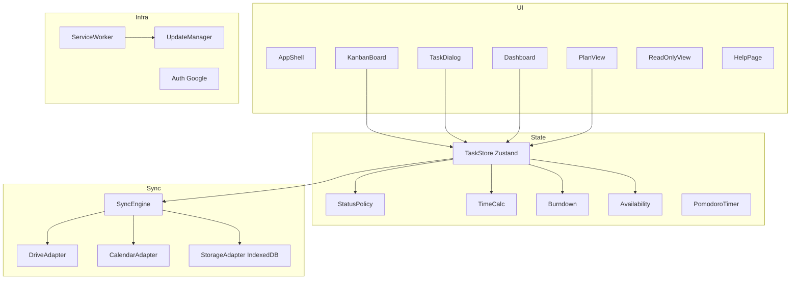
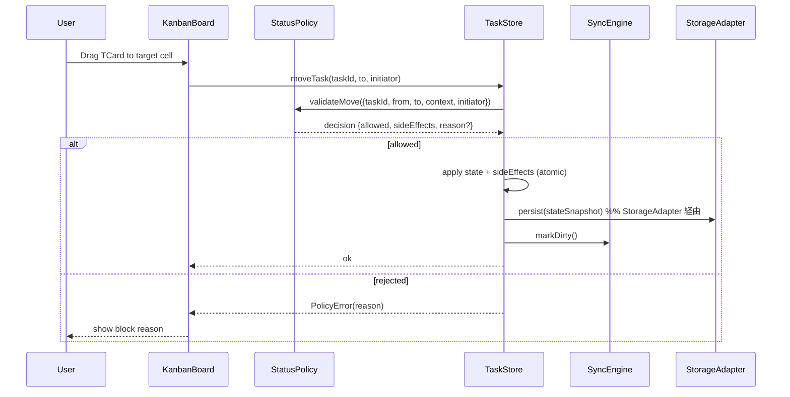
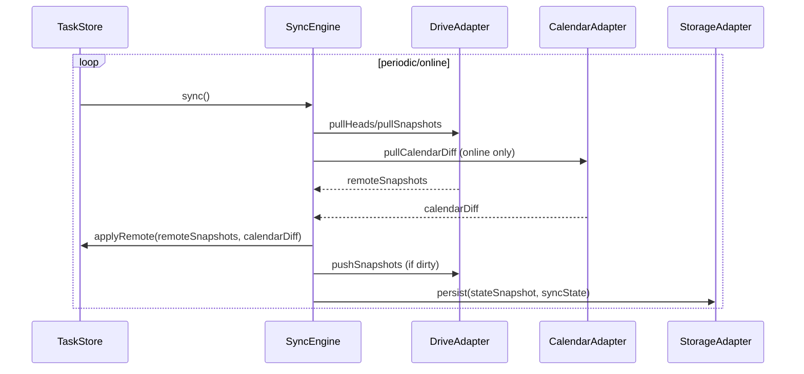
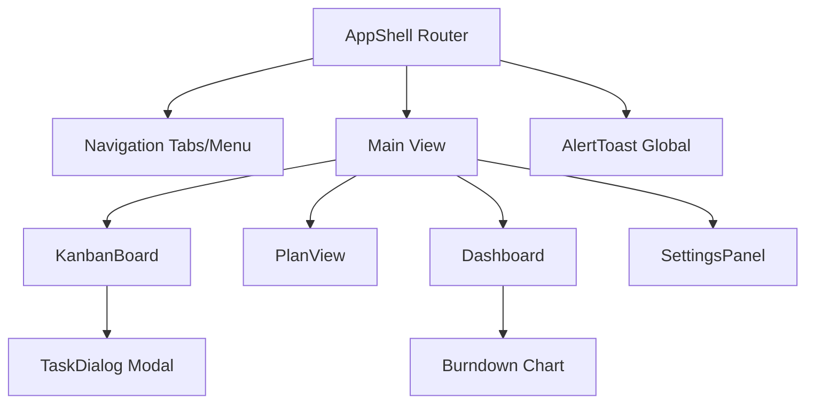

# Design Document

---
**Purpose**: 要件を満たすためのアーキテクチャとインターフェースを定義し、実装ブレを防ぐ。
---

## 用語集
| 正式名称 | 略称 | 種別 | 説明 |
| --- | --- | --- | --- |
| カンバンボード | KanbanBoard | UI（View/Board） | 教科×ステータスの固定グリッドを表示するボード View。 |
| プランビュー | PlanView | UI（View） | 月曜始まりカレンダーと予定/学習時間表示の View。 |
| 閲覧専用ビュー | ReadOnlyView | UI（View） | 閲覧専用モードの View。 |
| アラートバー | AlertToast | UI（Toast） | 同期/PT/過負荷などの非モーダル通知を画面右下のトーストで表示する UI 要素。 |
| ナビゲーション | Navigation | UI | View 切替のメニュー/タブ。 |
| チャート | Chart | UI | グラフ可視化要素（バーンダウンなど）。 |
| View | - | UI | 画面単位の UI。ルーティングで切替。 |
| Panel | - | UI | View 内の設定/補助エリア。 |
| Mode | - | 概念 | 機能/表示の切替状態（viewMode: editable/readonly、TaskDialog 入力モード: 個別/一括 など）。 |

## Overview
学習計画カンバン（LPK）はブラウザ完結の PWA として、教科×ステータスの固定グリッド上でタスクを運用し、オフラインでも編集・計測を継続し、オンライン復帰時に同期する。Google Drive を主ストレージ、Google Calendar を予定連携に用い、週次スプリントの計画と日次運用、週次レビューを一貫して支援する。

### Goals
- 固定ステータス列と教科行による2次元カンバンで、ドラッグ操作とダイアログ編集を安全に提供する。
- オフラインファーストのローカルストアと同期エンジンで、Google Drive/Calendar への双方向同期を実現する。
- 時間管理（予定/残り時間、PT、自動計測）と Today 過負荷警告を一貫したロジックで提供する。

### Non-Goals
- バックエンドサーバの新規構築（GitHub Pages 配信のみ）。
- RSC/SSR ベースの UI ランタイム（必要なら別途検討）。
- AI 自動スケジューリングなど要件外の高度機能。

## Architecture

### Existing Architecture Analysis
新規実装（既存コードなし）。ステアリングのスタック方針（React + Vite + TanStack Router + Zustand、PWA、Google API）を前提に設計する。

### Architecture Pattern & Boundary Map
採用: クライアントサイド Clean（Ports/Adapters）＋ローカルストア／同期エンジン分離。



### Thread / Worker Strategy
- Threads in scope: ブラウザメインスレッド（UI/状態/同期処理）＋ Service Worker（PWA キャッシュとバージョン更新制御）＋ Web Worker（Drive のマージ/差分計算などの CPU 負荷が高い処理）。
- Service Worker で扱うもの: precache/route によるオフラインキャッシュ、バージョン検知と `updatefound/statechange` 監視、`skipWaiting` とクライアントへのリロード要求、簡易なネットワークフェイルオーバー。Push/Periodic Background Sync はサーバレス方針＋Safari 制約のため不採用。
- メインスレッドで扱うもの: UI/状態管理（React+Zustand）、SyncEngine の `sync()`（pull→merge→push）、Drive/Calendar API 呼び出し（トークン失効 UI と連携しやすくする）、InProAutoTracker/Pomodoro の計測と通知、Availability/Calendar/Settings 編集（viewMode=readonly では編集無効化）、BackupService の開始/完了通知と UI 進捗。
- Web Worker で扱うもの: Drive の remote→local マージ（差分計算、PrioritySorter 再計算、必要なら Burndown 再計算）、バックアップの zip 圧縮/展開（大きい場合）。UI は操作不能なため、Worker は「状態を直接変更」せず「適用可能な patch（差分）」を返す。
- 採用基準: Service Worker でしかできないキャッシュ/バージョン更新/ネットフェイルオーバーのみ SW へ置き、フォアグラウンド実行が前提の同期・計測・編集ロジックはメインに限定する。バックグラウンドスケジュールやサーバ経由通知が必要になる場合は要件とサーバレス方針を再検討する。

### Technology Stack

| Layer | Choice / Version | Role in Feature | Notes |
|-------|------------------|-----------------|-------|
| Frontend | React 18 + Vite | SPA/PWA UI 実行基盤 | Vite で高速 dev/build、PWA プラグイン想定 |
| State | Zustand | グローバル状態とローカルキャッシュ | ミドル状態を hooks で提供 |
| Routing | TanStack Router | 画面遷移（カンバン/プラン/ヘルプ/閲覧専用） | 型安全ルーティング |
| UI | MUI + dnd-kit | コンポーネントと DnD | アクセシビリティ対応前提 |
| i18n | i18next + react-i18next | UI 文字列管理（将来の多言語対応） | `lang` は `ja-JP` 固定、言語切替 UI は提供しない |
| Data Store | IndexedDB | オフライン永続（状態＋同期状態） | StorageAdapter で抽象化 |
| Sync | Google Drive API / Google Calendar API | 主データ／予定の双方向同期 | Drive は JSON ファイル、Calendar は syncToken 差分 |
| PWA | Service Worker + @vite-pwa/plugin | オフラインキャッシュと強制アップデート | 非モーダル通知で更新 |
| Testing | Vitest + RTL + MSW + Playwright | 単体/統合/E2E | Steering/testing に準拠 |

## System Flows

### タスク移動（DnD）とステータス遷移ガード

Key: ローカル操作ではポリシーが Today 先頭のみ→InPro、OnHold 先頭のみ→InPro、Done 遷移条件、InPro 唯一性、自動 OnHold 退避を返す。端末間同期のマージ後に不整合（InPro 複数）が混入した場合は SyncEngine 側で正規化する（SyncEngine の Implementation Notes「Invariant 正規化（マージ後）」を参照）。

### オフライン同期サイクル（Drive/Calendar）

Key: syncToken 失効時はフル再取得、競合時は保守的マージ＋ユーザー通知。

### UI 階層構造（コンテナと主要画面）


### UI レイアウト（ASCII スケッチ）

#### KanbanView

- `Menu Button` をクリックすると SettingsPanel を表示する。
- `YYYY/MM/DD - MM/DD` のスプリント期間表示は週選択ダイアログを開き、前週/翌週ボタンでも切り替える。
- スプリント期間表示は週選択ダイアログで選択した週に連動して更新する。
- `プラン` ボタンで PlanView を表示する。
- `カンバン` と `ダッシュボード` はトグルで、表示している方をグレーアウトする
- `sync status` は Google Drive との同期状態をアイコンで示す
- `avator` は Google アカウントのアバターを表示
- `Num of Today/Due tasks` は本日実施予定のタスク数と完了したタスクを視覚的に表示する（過去・未来のスプリントを開いている場合は何も表示しない）
- `Estimate/Done Time ` は本日の勉強可能時間と実績時間を視覚的に表示する（過去・未来のスプリントを開いている場合は何も表示しない）
- 🍅 ボタンをクリックするとポモドーロタイマーが始まる

```ditaa
+-----------------------------------------------------------------------------------------------+
| AppBar: [Menu Button] [Logo] [◀][YYYY/MM/DD - MM/DD][▶] [プラン][カンバン|ダッシュボード] [sync][avatar] |
+-----------------------------------------------------------------------------------------------+
| Kanban Header: Num of Today/Done Tasks | Estimate/Done Time                           [🍅] |
+---------+-------------+-------------+---------------+-------------+------------+------------+
|         | Backlog     |    Today    |  InPro        |  OnHold     |   Done     | Won't fix  |
|---------+-------------+-------------+---------------+-------------+------------+------------|
|         |+-----------+|+-----------+|+-------------+|+-----------+|+----------+|+----------+|
| English ||TCard      |||           ||| TCard for   |||           |||          |||          ||
|         |+-----------+|+-----------+|| InPro       ||+-----------+|+----------+|+----------+|
|         |+-----------+|+-----------+||             ||             |+----------+|            |
|         ||           |||           |||             ||             ||          ||            |
|         |+-----------+|+-----------+||             ||             |+----------+|            |
|         |             |+-----------+||             ||             |            |            |
|         |     +       ||           |||             ||             |            |            |
|         |             |+-----------+|+-------------+|             |            |            |
|---------+-------------+-------------+---------------+-------------+------------+------------|
|         |+-----------+|+-----------+|               |             |            |            |
| Math    ||           |||           ||               |             |            |            |
|         |+-----------+|+-----------+|               |             |            |            |
|         |     +       |             |               |             |            |            |
|---------+-------------+-------------+---------------+-------------+------------+------------|
|         |+-----------+|             |               |             |            |            |
| Science ||           ||             |               |             |            |            |
+---------++-----------++-------------+---------------+-------------+------------+------------+
```

#### KanvanView with Pomodoro Timer

- Kanban Header は 🍅 ボタンのみを表示し、開始/再開でポモドーロオーバーレイを表示する。
- ポモドーロオーバーレイはカンバン右上のやや内側に小さめサイズで表示する。
- 集中/休憩フェーズは背景色で区別し、残り時間は中央に配置する。
- 進捗ゲージは時間の背面に表示し、10 秒刻みで更新する。
- 停止はオーバーレイを閉じてタイマーを停止し、リセットはタイマーと表示を初期化してオーバーレイを閉じる。

```ditaa
+---------------------------------------------------------------------------------------------+
| AppBar: [Menu Button] [Logo] [◀][YYYY/MM/DD - MM/DD][▶] [プラン][カンバン|ダッシュボード] [sync][avatar] |
+---------------------------------------------------------------------------------------------+
| Kanban Header: Num of Today/Done Tasks | Estimate/Done Time                           [🍅] |
|                                                                     +---------------------+ |
+---------+-------------+-------------+---------------+-------------+ | Pomodoro Time       | |
|         | Backlog     |    Today    |  InPro        |  OnHold     | |                     | |
|---------+-------------+-------------+---------------+-------------+ |                     | |
|         |+-----------+|+-----------+|+-------------+|+-----------+| |                     | |
| English ||TCard      |||           |||             |||           || |       Time          | |
|         |+-----------+|+-----------+||             ||+-----------+| |                     | |
|         |+-----------+|+-----------+||             ||             | |                     | |
|         ||           |||           |||             ||             | |                     | |
|         |+-----------+|+-----------+||             ||             | |   Stop    Reset     | |
|         |             |+-----------+||             ||             | +---------------------+ |
|         |     +       ||           |||             ||             |            |            |
|         |             |+-----------+|+-------------+|             |            |            |
|---------+-------------+-------------+---------------+-------------+------------+------------|
|         |+-----------+|+-----------+|               |             |            |            |
| Math    ||           |||           ||               |             |            |            |
|         |+-----------+|+-----------+|               |             |            |            |
|         |     +       |             |               |             |            |            |
|---------+-------------+-------------+---------------+-------------+------------+------------|
|         |+-----------+|             |               |             |            |            |
| Science ||           ||             |               |             |            |            |
+---------++-----------++-------------+---------------+-------------+------------+------------+
```

#### KanbanView with Alert

- 同期/過負荷/PT などの通知は、画面右下の `AlertToast` で非モーダル表示する。

```ditaa
+---------------------------------------------------------------------------------------------+
| AppBar: [Menu Button] [Logo] [◀][YYYY/MM/DD - MM/DD][▶] [プラン][カンバン|ダッシュボード] [sync][avatar] |
+---------------------------------------------------------------------------------------------+
| Kanban Header: Num of Today/Done tasks | Estimate/Done tasks                          [🍅] |
+---------+-------------+-------------+---------------+-------------+------------+------------+
|         | Backlog     |    Today    |  InProgress   |  OnHold     |   Done     | Won't fix  |
|---------+-------------+-------------+---------------+-------------+------------+------------|
|         |+-----------+|+-----------+|+-------------+|+-----------+|+----------+|+----------+|
| English ||TCard      |||           |||             |||           |||          |||          ||
|         |+-----------+|+-----------+||             ||+-----------+|+----------+|+----------+|
|         |+-----------+|+-----------+||             ||             |+----------+|            |
|         ||           |||           |||             ||             ||          ||            |
|         |+-----------+|+-----------+||             ||             |+----------+|            |
|         |             |+-----------+||             ||             |            |            |
|         |     +       ||           |||             ||             |            |            |
|         |             |+-----------+|+-------------+|             |            |            |
|---------+-------------+-------------+---------------+-------------+----- +-----+----------+ |
|         |+-----------+|+-----------+|               |             |      | Alert Toast 1  | |
| Math    ||           |||           ||               |             |      |                | |
|         |+-----------+|+-----------+|               |             |      +----------------+ |
|         |     +       |             |               |             |      +----------------+ |
|---------+-------------+-------------+---------------+-------------+----- | Alert Toast 2  | |
|         |+-----------+|             |               |             |      |                | |
| Science ||           ||             |               |             |      +----------------+ |
+---------++-----------++-------------+---------------+-------------+------------+------------+
```

#### KanbanView with Task Dialog

- `Task Dialog` はカンバンの中央に表示され、D&Dで移動可能。ダイアログ外をクリックするとダイアログはキャンセル扱いで閉じる。

```ditaa
+---------------------------------------------------------------------------------------------+
| AppBar: [Menu Button] [Logo] [◀][YYYY/MM/DD - MM/DD][▶] [プラン][カンバン|ダッシュボード] [sync][avatar] |
+---------------------------------------------------------------------------------------------+
| Kanban Header: Num of Today/Done Tasks | Estimate/Done Time                           [🍅] |
+---------+-------------+-------------+---------------+-------------+------------+------------+
|         | Backlog     |    Today    |  InPro        |  OnHold     |   Done     | Won't fix  |
|---------+-------------+-------------+---------------+-------------+------------+------------|
|         |+-----------+|+-----------+|+-------------+|+-----------+|+----------+|+----------+|
| English ||TCard      |||         +----------------------+        |||          |||          ||
|         |+-----------+|+-------- | Task Dialog          | -------+|+----------+|+----------+|
|         |+-----------+|+-------- |                      |         |+----------+|            |
|         ||           |||         |                      |         ||          ||            |
|         |+-----------+|+-------- |                      |         |+----------+|            |
|         |             |+-------- |                      |         |            |            |
|         |     +       ||         |                      |         |            |            |
|         |             |+-------- |                      |         |            |            |
|---------+-------------+--------- |                      | --------+------------+------------|
|         |+-----------+|+-------- |                      |         |            |            |
| Math    ||           |||         |                      |         |            |            |
|         |+-----------+|+-------- |                      |         |            |            |
|         |     +       |          |                      |         |            |            |
|---------+-------------+--------- |                      | --------+------------+------------|
|         |+-----------+|          +----------------------+         |            |            |
| Science ||           ||             |               |             |            |            |
+---------++-----------++-------------+---------------+-------------+------------+------------+
```

#### TCard

- TCard は縦に複数並ぶので横長で表示する。
- InPro 以外の TCard は、タイトルと期日（曜日）と予定/実績時間のゲージを表示する。
- `Planned/Spent Time` は体力ゲージ風の棒グラフで `■■■□□` のように予定時間と実績時間を可視化する（残り時間の数値は表示しない）。
- `Due Day of Week` はタスクの期日を曜日で表示する（期日がなければ表示しない）。
- `[icon]` はカレンダーアイコンで、期日が本日なら赤色で表示する（期日がなければ表示しない）。

```ditaa
+----------------------------------------+
|  Task Title     Planned/Spent Time     |
|                 [icon] Due Day of Week |
+----------------------------------------+
```

#### TCard (InPro)

- InPro の TCard は正方形で表示し、1 件のみ存在する。
- タイトルと予定/実績ゲージの間にドーナツ状の円形インジケーターをセンタリング表示する。
- 円形インジケーターは 60 分で一周し、表示する経過分はリセットせずに継続加算する。
- 進行中であることを示す淡色の点滅インジケーターを、分数表示の左上に控えめに表示する。
- 予定/実績ゲージは InPro 用の表示として同じカード内に保持し、経過時間に合わせて数値とゲージを更新する。

```ditaa
+------------------------------+
|          Task Title          |
|------------------------------|
|         ( Circle )           |
|        Progress Ring         |
|            25 min            |
|------------------------------|
|    Planned/Spent Time        |
|    ■■■■■□□□□□□    |
|   [icon] Due Day of Week     |
+------------------------------+
```

#### Task Dialog

- `Spent Time` の `[+]` ボタンをクリックすると実績を記録できる。
- `Spent Time` の中には、実績をリストで表示する。
- 予定時間/実績時間の入力は数値以外を除去し、空欄の場合は `0` を補完する。
- ポモドーロ更新中でも、開いている TDialog の入力は再初期化しない。

```ditaa
+--------------------------+
| +----------------------+ |
| | Task title           | |
| |----------------------| |
| | Description          | |
| |                      | |
| |                      | |
| |                      | |
| |                      | |
| |                      | |
| |----------------------| |
| | Planned Time         | |
| |----------------------| |
| | Spent Time      [+]  | |
| | +------------------+ | |
| | |Day & Time        | | |
| | +------------------+ | |
| | |Day & Time        | | |
| | +------------------+ | |
| |----------------------| |
| | dueAt                | |
| +----------------------+ |
| +---+    +--------+----+ |
| |Del|    | Cancel | OK | |
| +---+    +--------+----+ |
+--------------------------+
```

#### PlanView

```ditaa
+-----------------------------------------------------------------------------------------------+
| AppBar: [Menu Button] [Logo] [◀][YYYY/MM/DD - MM/DD][▶] [プラン][カンバン|ダッシュボード] [sync][avatar] |
+-----------------------------------------------------------------------------------------------+
| Plan                                                                                           |
| +-----------------------------------------------------------------------------------------+ |
| | DateCalendar (Mon start, week highlight, hover highlight)                                | |
| +-----------------------------------------------------------------------------------------+ |
| | Day View: Selected Date                                                                  | |
| | - Due Tasks                                                                              | |
| | - Overdue                                                                                | |
| | - Added Today                                                                            | |
| | - Actual                                                                                | |
| +-----------------------------------------------------------------------------------------+ |
| | Availability (0.5h〜15.0h Select)                                                        | |
| +-----------------------------------------------------------------------------------------+ |
| | Events: Title input + Add, list with empty state + offline error                          | |
| +-----------------------------------------------------------------------------------------+ |
+-----------------------------------------------------------------------------------------------+
```

- PlanView の上部は合計可能/計画/実績のサマリのみを表示し、週選択は AppBar 側で行う。
- PlanView は画面幅に応じて 1〜3 列のグリッドに切り替え、横幅に余裕がある場合は左列に月カレンダーを表示する。
- main panel と side panel は画面高に合わせて伸長し、縦方向の余白を最小化する。
- 日別の学習可能時間は 0.5〜15.0 の 0.5h 単位で選択し、計画/実績の比較は日別棒グラフで表示する。
- `seed=massive` を URL クエリに指定した場合は、学習可能時間/タスク/予定を固定データで初期化し、ナビゲーション時にクエリを保持する。

#### DashboardView

```ditaa
+-----------------------------------------------------------------------------------------------+
| AppBar: [Menu Button] [Logo] [◀][YYYY/MM/DD - MM/DD][▶] [プラン][カンバン|ダッシュボード] [sync][avatar] |
+-----------------------------------------------------------------------------------------------+
| Dashboard                                                                                    |
| +-----------------------------------------------------------------------------------------+ |
| | Status Summary by Subject (Backlog/Today/InPro/OnHold/Done/WontFix)                       | |
| +-----------------------------------------------------------------------------------------+ |
| | Weekly Summary (Done count, Actual minutes)                                              | |
| +-----------------------------------------------------------------------------------------+ |
| | Burndown (Daily remaining count/minutes)                                                 | |
| +-----------------------------------------------------------------------------------------+ |
+---------------------------------------------------------------------------------------------+
```

##### Weekly Resource Manager
- Dashboard は「週次リソース調整」モードを持ち、残作業/可用枠/収支を表示する Resource HUD を最上段に配置する。
- 日別負荷ストリップで、日別の残作業と可用枠を並列表示する。推定枠はハッチングと警告バッジで区別する。
- アクションテーブルは「提案理由」「影響（今週の負荷減/来週の負荷増）」を明示し、推奨日へ移動するボタンは日付入りラベルにする。
- 提案なしのタスクは Backlog へ戻す操作のみを提供し、無理な日付指定操作は提供しない。
- InPro タスクはアクションテーブルから除外し、除外理由を注記する。
- Dashboard は `today` クエリ指定がある場合、基準日を指定日に上書きする。

```ditaa
+------------------------------------------------------------------------------------------------------+
| Resource HUD: This Week (Remaining/Capacity/Balance) | Next Week (Confirmed + Estimated)            |
+------------------------------------------------------------------------------------------------------+
| Daily Load Strip: Today → Sun, Next Mon → Thu (Estimated days show ⚠ Est)                            |
+------------------------------------------------------------------------------------------------------+
| Action Table: Overdue/Overflow -> Proposal + Reason + Impact + Action (Move to MM/DD)               |
+------------------------------------------------------------------------------------------------------+
```

```text
+----------------------------------------------------------------------------------------------------------------------------+
|  [Header]                                                                                                                  |
|  Week 45 リソース調整                                                               [ ↶ Undo (直前の操作を戻す) ]      |
+----------------------------------------------------------------------------------------------------------------------------+
|                                                                                                                            |
|  [SECTION A: RESOURCE HUD]                                                                                                 |
|  +-------------------------------------------------------+      +-------------------------------------------------------+  |
|  |  THIS WEEK (残り2日)                                  |      |  NEXT WEEK (11/13 - 11/19)                            |  |
|  |  残作業 :   8.5 h  (内 InPro: 2.0h)                   |  >>  |  受入可能枠 :  18.0 h                                 |  |
|  |  可用枠 :   4.0 h  (確定済)                           |      |  [ 確定: 6.0h ]  +  [ 推定: 12.0h (////) ] ⚠        |  |
|  |  ---------------------------------------------------  |      |  ---------------------------------------------------  |  |
|  |  収支   :   [ ■■ -4.5 h (OVERFLOW) ]                  |      |  空き枠     :  [ ■■■■■■ 14.0 h ] (⚠ 推定含む)       |  |
|  +-------------------------------------------------------+      +-------------------------------------------------------+  |
|                                                                                                                            |
+----------------------------------------------------------------------------------------------------------------------------+
|                                                                                                                            |
|  [SECTION B: DAILY LOAD STRIP]                                                                                             |
|                                                                                                                            |
|  [Today: Fri]   [Sat]      [Sun]        |   [Mon]      [Tue]      [Wed]      [Thu]                                         |
|  +----------+   +--------+ +--------+   |   +--------+ +--------+ +--------+ +--------+                                    |
|  |  11/10   |   | 11/11  | | 11/12  |   |   | 11/13  | | 11/14  | | 11/15  | | 11/16  |                                    |
|  | [OVER!]  |   | [FULL] | | [OK]   |   |   | [FREE] | | [FREE] | | [OK]   | | [FREE] |                                    |
|  | Cap:2.0h |   | Cap:2h | | Cap:4h |   |   | Cap:2h | | Cap:?? | | Cap:?? | | Cap:?? |                                    |
|  +----------+   +--------+ +--------+   |   +--------+ +--------+ +--------+ +--------+                                    |
|  |  Rem:5h  |   | Rem:2h | | Rem:1h |   |   | Rem:0h | | Rem:0h | | Rem:1h | | Rem:0h |                                    |
|  | [■■■■■]  |   | [■■]   | | [■]    |   |   |        | | [░░░░] | | [■░░░] | | [░░░░] |                                    |
|  | [■■■■■]  |   | [■■]   | | [■]    |   |   |        | | [░░░░] | | [■░░░] | | [░░░░] |                                    |
|  |          |   |        | |        |   |   |        | |  ⚠Est  | |  ⚠Est  | |  ⚠Est  |                                    |
|  +----------+   +--------+ +--------+   |   +--------+ +--------+ +--------+ +--------+                                    |
|                                                                                                                            |
+----------------------------------------------------------------------------------------------------------------------------+
|                                                                                                                            |
|  [SECTION C: ACTION TABLE]                                                                                                 |
|  ※ 進行中 (InPro) のタスクはここには表示されません。                                                                       |
|                                                                                                                            |
|  ▼ 1. DEADLINE VIOLATION & OVERFLOW                                                                                        |
|  +----------------------------------------------------------------------------------------------------------------------+  |
|  |  TASK (REM)          |  STATUS             |  PROPOSAL (REASON)              |  IMPACT               |  ACTION       |  |
|  +----------------------+---------------------+---------------------------------+-----------------------+---------------+  |
|  |  英語 長文 (2.5h)    |  [OnHold] 昨日期限  |  推奨: 11/14(火)                |  今週: -2.5h(負荷減)  | [ 11/14へ移動 ]| |
|  |                      |                     |  理由: 英語なし・空き最大       |  来週: +2.5h(⚠推定)   |               |  |
|  +----------------------+---------------------+---------------------------------+-----------------------+---------------+  |
|  |  数学 積分 (3.0h)    |  [Today] 本日超過   |  推奨: 11/13(月)                |  今週: -3.0h(負荷減)  | [ 11/13へ移動 ]| |
|  |                      |                     |  理由: 確定枠内で収容可能       |  来週: +3.0h(緑)      |               |  |
|  +----------------------+---------------------+---------------------------------+-----------------------+---------------+  |
|  |  化学 演習 (4.0h)    |  [Today] 昨日期限   |  ⚠ 提案なし (空き枠不足)        |  今週: 計画除外       | [ Backlogへ ] |  |
|  |                      |                     |  理由: 来週全ての枠に入りません |  来週: 変更なし       |               |  |
|  +----------------------+---------------------+---------------------------------+-----------------------+---------------+  |
|                                                                                                                            |
|  [ 一括操作エリア ]                                                                                                        |
|  ------------------------------------------------------------------------------------------------------------------------  |
|  [⚡ 推奨日へ一括変更 (2件)]      (※「提案なし」の化学演習は対象外です)                                                   |
|                                                                                                                            |
+----------------------------------------------------------------------------------------------------------------------------+
```

#### Settings Panel over KanbanView

- `Settings Panel` は KanbanView や DashboardView にオーバーレイ表示する

```ditaa
+---------------------------------------------------------------------------------------------+
| +--------------------------------+ MM-DD HH:MM] [Kanban | Dashboard] [sync status] [avatar] |
+ | Settings Panel                 | ---------------------------------------------------------+
| |                                | sks | Estimate/Done Time                        [🍅]    |
+ |                                | -+---------------+-------------+------------+------------+
| |                                |  |  InPro        |  OnHold     |   Done     | Won't fix  |
| |                                | -+---------------+-------------+------------+------------|
| |                                | +|+-------------+|+-----------+|+----------+|+----------+|
| |                                | |||             |||           |||          |||          ||
| |                                | +||             ||+-----------+|+----------+|+----------+|
| |                                | +||             ||             |+----------+|            |
| |                                | |||             ||             ||          ||            |
| |                                | +||             ||             |+----------+|            |
| |                                | +||             ||             |            |            |
| |                                | |||             ||             |            |            |
| |                                | +|+-------------+|             |            |            |
| |                                | -+---------------+-------------+------------+------------|
| |                                | +|               |             |            |            |
| |                                | ||               |             |            |            |
| |                                | +|               |             |            |            |
| |                                |  |               |             |            |            |
| |                                | -+---------------+-------------+------------+------------|
| |                                |  |               |             |            |            |
| +--------------------------------+  |               |             |            |            |
+---------++-----------++-------------+---------------+-------------+------------+------------+
```

## Requirements Traceability

| Requirement | Summary | Components | Interfaces | Flows |
|-------------|---------|------------|------------|-------|
| 1.1 | 固定ステータス列と教科行でボード構成 | KanbanBoard, TaskStore | StatusPolicy | タスク移動 |
| 1.2 | スプリント1週固定で開始/終了日表示 | SprintSelector, Dashboard | TaskStore | - |
| 1.3 | 初期表示はカンバンのみ | AppShell, KanbanBoard | Router | - |
| 1.4 | ステータス列ロック | KanbanBoard | StatusPolicy | タスク移動 |
| 1.5 | ステータス表示名設定のみ許可 | SettingsStore | Settings API | - |
| 1.6 | 教科順変更をスプリント単位保存 | TaskStore | StorageAdapter | - |
| 1.7 | タスクある教科は削除不可 | TaskStore | StatusPolicy | - |
| 1.8 | Backlog プラスで作成ダイアログ | KanbanBoard, TaskDialog | - | - |
| 1.9 | 空セルドラッグでスクロール＆ヘッダー固定 | KanbanBoard | - | - |
| 2.1 | 新規 TDialog で属性入力保存（優先度は D&D で変更） | TaskDialog | TaskStore | - |
| 2.2 | 既存 Task 読込編集保存 | TaskDialog | TaskStore | - |
| 2.3 | TCard にタイトル/期日/予定/実績/ゲージ | TaskCard | TimeCalc | - |
| 2.4 | ダイアログでタイトルに初期フォーカス | TaskDialog | - | - |
| 2.5 | Tab 移動 | TaskDialog | - | - |
| 2.6 | 保存: Ctrl+Enter/ボタン, Esc/キャンセル | TaskDialog | - | - |
| 2.7 | 保存/キャンセル/消去操作 | TaskDialog | TaskStore | - |
| 2.8 | 日付別実績累積表示 | TaskDialog | TimeCalc | - |
| 2.9 | 実績の手動修正許可 | TaskDialog | TaskStore | - |
| 2.10 | 数値入力の正規化と 0 補完 | TaskDialog | TaskStore | - |
| 2.11 | PT 更新中の TDialog 再初期化抑止 | TaskDialog | - | - |
| 3.1 | ステータス/教科間ドラッグで移動保存 | KanbanBoard, TaskStore | StatusPolicy | タスク移動 |
| 3.2 | ドラッグ中に有効セルをハイライト | KanbanBoard | StatusPolicy | タスク移動 |
| 3.3 | セル内優先度順ソート | KanbanBoard | PrioritySorter | - |
| 3.4 | セル内並び替えを保存 | TaskStore | StorageAdapter | - |
| 3.5 | マウス/タッチ両方サポート | KanbanBoard | DnD API | - |
| 3.6 | TCard 横長、InPro 正方形 | TaskCard | - | - |
| 3.7 | InPro は常に1件で積み上げなし | StatusPolicy, TaskCard | - | タスク移動 |
| 3.8 | Today 最優先以外→InPro 禁止 | StatusPolicy | - | タスク移動 |
| 3.9 | InPro のみ1件、他は OnHold へ自動移動 | StatusPolicy, TaskStore | - | タスク移動 |
| 3.10 | InPro/OnHold 以外→Done 禁止 | StatusPolicy | - | タスク移動 |
| 3.11 | OnHold→InPro は同一教科の先頭のみ許可 | StatusPolicy | - | タスク移動 |
| 3.12 | InPro の置換は退避タスクを OnHold 先頭へ挿入し再採番 | StatusPolicy, TaskStore | - | タスク移動 |
| 3.13 | Today/InPro/OnHold 残り時間超過で警告 | AlertToast, Availability, TimeCalc | - | - |
| 3.14 | InPro 自動計測＋円形インジケータ | PomodoroTimer, TaskCard | TimeCalc | - |
| 3.15 | PT 操作と通知 | PomodoroTimer, AlertToast | - | - |
| 3.16 | PT 終了時アラーム | PomodoroTimer, AlertToast | - | - |
| 3.17 | PT 開始/再開の 🍅 ボタンとオーバーレイ | PomodoroTimer, KanbanBoard | - | - |
| 3.18 | PT 停止/リセットでオーバーレイ終了 | PomodoroTimer, KanbanBoard | - | - |
| 3.19 | PT フェーズ色分けとゲージ更新 | PomodoroTimer, KanbanBoard | - | - |
| 4.1 | Dashboard で週次集計を表示 | Dashboard | Burndown | - |
| 4.2 | 今日期日 Backlog 強調 | KanbanBoard | TimeCalc | - |
| 4.3 | 期日超過フラグ/リスト | Dashboard | TimeCalc | - |
| 4.4 | バーンダウンチャート | Dashboard | Burndown | - |
| 4.5 | 月曜始まりカレンダー選択 | PlanView | Router | カレンダーフロー |
| 4.6 | Calendar 予定取得し表示（学習可能時間は自動反映しない） | PlanView | CalendarAdapter, Availability | カレンダーフロー |
| 4.7 | LPK カレンダー更新を Google Calendar に反映 | PlanView | CalendarAdapter | カレンダーフロー |
| 4.8 | 特定日ビューで3種のタスク一覧 | PlanView | TaskStore | - |
| 4.9 | 曜日ごとの作業可能時間デフォルト | Availability | SettingsStore | - |
| 4.10 | 特定日上書き | Availability | TaskStore | - |
| 4.11 | 予定を表示して学習可能時間調整の参考にする（自動反映なし） | Availability | CalendarAdapter | カレンダーフロー |
| 4.12 | 当日の予定と、手入力の学習可能時間に基づく残り学習可能時間ゲージ表示 | KanbanBoard | Availability, TimeCalc | - |
| 4.13 | 教科別完了数/時間の週次サマリ | Dashboard | Burndown, TimeCalc | - |
| 4.14 | 当日追加タスクのみ表示 | PlanView | TaskStore | - |
| 4.15 | ヘルプページ提供（SettingsPanel から起動） | HelpPage, SettingsPanel | Router | - |
| 4.16 | 予定/実績時間グラフ表示 | PlanView | TimeCalc | - |
| 4.17 | バーンダウン日次残工数を記録しスナップショットで再現 | Burndown, TaskStore | StorageAdapter | - |
| 4.18 | 選択週のハイライトと日付ビュー反映 | PlanView | - | - |
| 4.19 | 日付ビューの4セクションと空状態 | PlanView | TaskStore | - |
| 4.20 | 学習可能時間の日別上書き保持 | Availability | TaskStore | - |
| 4.21 | 予定タイトル必須で選択日基準の登録 | PlanView | CalendarAdapter | カレンダーフロー |
| 4.22 | オフライン予定追加の拒否とエラー表示 | PlanView | CalendarAdapter | カレンダーフロー |
| 4.23 | 予定一覧と空状態表示 | PlanView | CalendarAdapter | - |
| 4.24 | 教科別ステータス集計の表示順 | Dashboard | TaskStore | - |
| 4.25 | 週次サマリの完了件数/実績時間表示 | Dashboard | Burndown, TimeCalc | - |
| 4.26 | バーンダウン一覧の日付昇順表示 | Dashboard | Burndown | - |
| 5.1 | PWA インストール、主要ブラウザ対応 | AppShell, ServiceWorker | UpdateManager | - |
| 5.2 | GitHub Pages 配信 | Build/Hosting | - | - |
| 5.3 | Google サインインで Drive 保存 | Auth, DriveAdapter | SyncEngine | - |
| 5.4 | オンライン時ローカルキャッシュ＋随時/定期同期 | TaskStore, SyncEngine | StorageAdapter | 同期フロー |
| 5.5 | オフライン操作と再接続同期 | TaskStore, SyncEngine | StorageAdapter | 同期フロー |
| 5.6 | 同期状態の非モーダル通知と再試行 | AlertToast, SyncEngine | - | 同期フロー |
| 5.7 | サーバレス構成（Pages＋Drive） | Architecture | - | - |
| 5.8 | バージョンチェックと自動アップデート | UpdateManager | ServiceWorker | 更新フロー |
| 5.9 | 強制アップデート | UpdateManager | ServiceWorker | 更新フロー |
| 5.10 | Drive 複数ファイルは専用ディレクトリ | DriveAdapter | - | - |
| 5.11 | 将来の API 拡張性 | SyncEngine, TaskStore | Ports | - |
| 5.12 | gh スクリプトで保護/マージ方式/Pages 設定 | RepoSetupScript | GitHub API | - |
| 5.13 | データバックアップとローテーション | SyncEngine, DriveAdapter, StorageAdapter | - | - |
| 6.1 | 閲覧専用リンク/権限 | ReadOnlyView, Auth | Router | - |
| 6.2 | 閲覧専用 PWA モード | ReadOnlyView | ServiceWorker | - |
| 6.3 | 閲覧モードの自動更新/オフライン表示 | ReadOnlyView, SyncEngine | StorageAdapter | 同期フロー |
| 6.4 | 招待無効化で閲覧遮断 | Auth, Router | - | - |
| 7.1 | i18n 基盤（`ja-JP` 固定） | AppShell, i18n | - | - |
| 7.2 | 設定永続 | SettingsStore | StorageAdapter | - |
| 8.1 | main push で自動テスト | CI | - | - |
| 8.2 | テスト成功でビルド | CI | - | - |
| 8.3 | ビルド成功で Pages デプロイ | CI | - | - |
| 8.4 | デプロイ結果通知 | CI | - | - |

## Components and Interfaces

### Summary Table
| Component | Domain/Layer | Intent | Req Coverage | Key Dependencies (P0/P1) | Contracts |
|-----------|--------------|--------|--------------|--------------------------|-----------|
| AppShell | UI | ルーティングとシェル、閲覧モード切替 | 1.3,6.1,7.1 | Router (P0), ServiceWorker (P1) | State |
| KanbanBoard | UI | 教科×ステータスグリッドと DnD | 1.x,3.x,4.2,4.12,3.17-3.19 | StatusPolicy (P0), TaskStore (P0), DnD Kit (P1) | State |
| TaskCard | UI | タスク表示（ゲージ/円形インジケータ） | 2.3,3.6,3.12,3.14 | TimeCalc (P0), PomodoroTimer (P1), InProAutoTracker (P0) | State |
| TaskDialog | UI | 作成/編集/消去と入力制御 | 1.8,2.x | TaskStore (P0) | Service |
| Dashboard | UI | 週次集計・バーンダウン | 4.1,4.3,4.4,4.13,4.24-4.26 | Burndown (P0) | State |
| SettingsPanel | UI | ステータス表示名を設定し、バージョン/アップデート状態、PT デフォルト時間、手動同期、ヘルプ導線を提供 | 1.5,5.8,5.9,5.14,3.13,5.6,4.15 | TaskStore (P0), UpdateManager (P1), SyncEngine (P1) | State |
| PlanView | UI | 月曜始まりカレンダーと予定/学習時間表示 | 4.5-4.23 | CalendarAdapter (P0), Availability (P0) | State |
| HelpPage | UI | 操作説明 | 4.15 | - | - |
| AlertToast | UI | 非モーダル通知（トースト: 同期/PT/過負荷） | 3.11,3.13,3.15,3.16,4.6,5.6,5.8 | SyncEngine (P0), TimeCalc (P0) | State |
| TaskStore | State | タスク/教科/スプリント状態と IndexedDB 永続 | 全般 | StorageAdapter (P0), SyncEngine (P0) | State |
| StatusPolicy | Domain | ステータス遷移ガードと副作用計算 | 1.4,3.x | - | Service |
| PrioritySorter | Domain | セル内優先度（並び順）正規化 | 3.3,3.4 | TaskStore (P1) | Service |
| InProAutoTracker | Domain | InPro 滞在中の自動実績反映 | 3.12 | TaskStore (P0) | Service |
| TimeCalc | Domain | 残り時間計算と Today 負荷 | 2.3,3.11,4.2,4.12 | TaskStore (P1) | Service |
| Burndown | Domain | バーンダウン計算と週次サマリ | 4.1,4.4,4.13,4.17,4.26 | TaskStore (P1) | Service |
| Availability | Domain | 学習可能時間（予定/上書き/曜日）計算 | 4.6,4.9-4.12,4.20 | CalendarAdapter (P1), SettingsStore (P1) | Service |
| PomodoroTimer | Domain | PT 計測と通知 | 3.12-3.19 | AlertToast (P1) | Service |
| SyncEngine | Sync | スナップショットの双方向同期 | 5.3-5.6,6.3 | DriveAdapter (P0), CalendarAdapter (P0), StorageAdapter (P0) | Service |
| BackupService | Sync | バックアップ取得・保持・復元 | 5.13 | DriveAdapter (P0), StorageAdapter (P0) | Service |
| DriveAdapter | Integration | Drive API 呼び出し | 5.3,5.10 | Auth (P0) | API |
| CalendarAdapter | Integration | Calendar API 呼び出し | 4.6-4.12,4.21-4.23 | Auth (P0) | API |
| StorageAdapter | Infra | IndexedDB CRUD | 5.4,5.5 | - | Service |
| UpdateManager | Infra | バージョン検知と強制アップデート | 4.1,5.8,5.9 | ServiceWorker (P0) | Service |
| Auth | Infra | Google 認証とトークン管理 | 5.3,6.1 | Google OAuth (P0) | Service |
| CI | Tooling | CI/CD の実行基盤 | 8.x | - | - |
| RepoSetupScript | Tooling | gh コマンドでブランチ保護・マージ方式・Pages 設定を適用 | 5.12 | GitHub API (P0) | Service |

### UI Layer

**View Mode 管理**
- ソース: AppShell/Router が Auth 完了後に対象データフォルダ（`dataFolderId`）への権限を確認し `viewMode: 'editable' | 'readonly'` を決定する（閲覧専用は全画面共通の Mode）。
  - `mode=readonly` または `sharedFolderId` が指定されている場合（学習者が発行した招待 URL 由来）、`dataFolderId = sharedFolderId` として **readonly で固定**して開く（招待 URL 経由では編集に昇格しない）。
  - 指定が無い場合は、ユーザー自身の Google Drive 上で `/LPK/` フォルダ（アプリ専用ディレクトリ）を解決し、読み書き可能なら editable とする。読み取りのみの場合は readonly とする。
  - `dataFolderId` の権限確認は Drive の capability（例: `canEdit`）で判定し、読み取り専用権限の場合は常に readonly とする。
- 伝播: viewMode をコンテキストまたは props で各画面（KanbanBoard/TaskDialog/PlanView/Dashboard/SettingsPanel/Availability 等）へ渡し、編集操作をガードする。PlanView での予定追加/更新、Availability の学習可能時間上書き、SettingsPanel のラベル/更新操作も無効化する。一方で、閲覧者の UI 操作としての「スプリント選択（`UiSettings.currentSprintId` の更新）」は許可する（Drive への書き込みは行わない）。
- 永続化: viewMode は一時的なアクセスモードであり、settings/sprint には保存しない。

#### KanbanBoard
| Field | Detail |
|-------|--------|
| Intent | 教科×ステータス固定グリッド、DnD 操作を提供 |
| Requirements | 1.1-1.9,3.1-3.8,4.2,4.12 |
| Contracts | State |

**Responsibilities & Constraints**
- 構造: `AppShell[AppBar]` と `KanbanView[Header][Container]` を分離し、`Container` は縦スクロールのみとする（AppBar と Kanban Header は固定）。ステータス行は縦スクロール時に上部へ張り付く。
- レイアウト: 教科列は幅固定で左に配置するが sticky にはしない。画面幅が十分な場合は教科列を除く横幅を固定ステータス列で均等割り、狭い場合は Today/InPro/OnHold を固定幅、Backlog/Done/WontFix を相対的に狭める。極端に狭い場合はボード全体を横スクロールさせてもよい。
- 最小幅: ステータス列には最小幅を設ける（TCard のタイトル 10 文字程度＋予定/実績時間＋期日を省略せず表示できること）。最小幅は UI 定数（例: `--lpk-status-col-min-width`）として集約する。
- DnD は StatusPolicy の判定結果に従い、ドラッグ中に有効セルのみをハイライトし、無効セルではドロップを受け付けず元の位置に戻す。
- TCard の DnD 中は縦スクロールを行わず、ドロップ対象は「ドラッグ開始時点で DOM 上に存在する教科行」に限定する。横方向は画面幅に応じたリサイズを優先し、極端に狭い場合のみボード全体の横スクロールを許可する（自動横スクロールは行わない）。
- ドロップ位置は挿入プレビュー（挿入ライン/プレースホルダ）を必須とし、カードの矩形（bounding box）ベースで「上半分/下半分」を判定して `insertIndex` を決める（InPro への遷移は `insertIndex=0` 固定でのみ許可）。空セルへのドロップは末尾挿入とする（同一セル/別セルで同一規則）。
- 空セルドラッグでスクロール補助、Backlog プラスから TaskDialog を起動。
- viewMode が readonly の場合は DnD/ダイアログ起動など編集操作を無効化し、表示のみとする。Subject 行の並べ替え/追加/削除も禁止。

**Dependencies**
- Inbound: Router — 表示切替 (P2)
- Outbound: StatusPolicy — 遷移可否/副作用取得 (P0); TaskStore — 状態更新 (P0); PrioritySorter — 優先度（並び順）正規化 (P1); TimeCalc — ゲージ/警告 (P1)
- External: dnd-kit — DnD 実装 (P1)

**Implementation Notes**
- Touch: タッチでの DnD はスクロール誤操作を避けるため、一般的な長押し開始遅延（例: 200-300ms 程度）を設定し、体験に応じて調整可能にする。
- Validation: ドロップ前に StatusPolicy の結果を確認し、無効セル/`insertIndex` ではドロップを無効化（プレビュー/ハイライトで示す）。警告は AlertToast へ。
- Risks: 大量カードで描画負荷→縦スクロール主体のため「教科行（row）単位のバーチャライゼーション（仮想スクロール）」を第一候補とする（横方向は仮想化しない）。DnD 中は縦スクロール無効化に加え、ドラッグ開始時点の仮想化レンジ（可視行 + overscan）をドラッグ終了まで固定し、行のアンマウントを抑止してドロップ判定と挿入プレビューを安定化する。
- Auto 横スクロール: 廃止（極端に狭い場合のみブラウザの横スクロールで対応する）。
- PoC: 縦スクロール＋固定ヘッダー、画面幅に応じたステータス列リサイズ（均等割り/固定幅/ボード横スクロール許容）を組み合わせたスパイクを先行実施し、性能受け入れ基準（教科 14、各セル 35 件の TCard）で操作が破綻しないことを確認する。

#### TaskDialog
| Field | Detail |
|-------|--------|
| Intent | タスク作成/編集/消去をフォーム操作で行う（個別追加と一括追加を切替可能） |
| Requirements | 1.8,2.x |
| Contracts | Service |

**Responsibilities & Constraints**
- タイトル初期フォーカス、Tab ナビゲーション、Ctrl+Enter/Enter 保存、Esc/キャンセル。
- 実績時間は `TaskActual` の一覧として扱い、以下を提供する:
  - 追加: `startedAt`（開始時刻）と `durationMinutes`（勉強時間）を入力して新規作成する。
  - 変更: 既存レコードの `startedAt` と `durationMinutes` を更新できる（`updatedAt` と `updatedByDeviceId` を更新する）。
  - 削除: 既存レコードを削除できる（`deletedAt` を設定して tombstone とし、同期で伝播する）。
  - 表示: `startedAt` が古い順にソートして表示する（同一 `startedAt` は `createdAt` の古い順）。
- 優先度は TaskDialog では変更せず、TCard の D&D でのみ変更する。新規 Task は対象セルの最下位（最低優先度）に追加する。
- viewMode が readonly の場合は、ドメインデータ（タスク/スプリント/設定/予定）への書き込みに関わる入力を無効化し表示専用とする（例外: `UiSettings` の変更、スプリントの選択、更新間隔設定などの端末ローカル UI 設定は許可）。
- InPro 滞在中の自動実績加算は InProAutoTracker が担い、PomodoroTimer とは独立運用する（Pomodoro は通知・休憩管理に専念）。
- Backlog から起動する場合は教科が自明なため、教科入力なしで作成する。ダイアログ内で「個別追加（詳細入力）」と「一括追加（複数行テキストで1行=1タスク、タイトルのみ）」を切替でき、選択状態を記憶する。一括作成後の詳細編集は通常の TCard 編集で行う。

**Dependencies**
- Outbound: TaskStore — CRUD (P0); TimeCalc — 残り時間計算 (P1)

**Contracts**: Service [x] / API [ ] / Event [ ] / Batch [ ] / State [ ]
```typescript
// タスク作成・更新・削除を扱うダイアログ向けサービス
interface TaskDialogService {
  createTask(input: TaskInput): Result<TaskId, ValidationError>; // 必須項目を検証し新規作成
  updateTask(taskId: TaskId, input: TaskInput): Result<void, ValidationError>; // 既存タスクを更新
  deleteTask(taskId: TaskId): Result<void, Error>; // タスクを消去
}
```
- Preconditions: 必須フィールド（タイトル、期日、教科、ステータス）を検証。
- Postconditions: TaskStore に反映し、必要なら `syncState.dirty` を true にする（オンライン時に SyncEngine が `sync()` を実行）。

**Implementation Notes**
- Integration: フォーカストラップと aria-modal、aria-labelledby を設定。
- Risks: 大量フィールドでの入力遅延→遅延保存を避け即時バリデーション。

#### Dashboard
| Field | Detail |
|-------|--------|
| Intent | 週次集計、バーンダウン |
| Requirements | 4.1,4.3,4.4,4.13,4.24-4.26 |
| Contracts | State |

**Responsibilities & Constraints**
- バーンダウン計算、期日超過リスト、教科別完了/学習時間集計。
- 教科別ステータス集計は 1 行で Backlog/Today/InPro/OnHold/Done/WontFix の順に件数を表示する。
- 週次サマリは教科ごとに完了件数と実績時間（分）を表示し、空の場合は 0 を表示する。
- バーンダウン一覧はスプリント期間の日付を昇順で並べる。
- viewMode が readonly の場合は閲覧のみとし、編集/保存操作は提供しない。

**Dependencies**
- Outbound: Burndown (P0); TimeCalc (P1); TaskStore (P0)

**Implementation Notes**
- Integration: グラフは日次サマリをキャッシュし、表示時に再計算を避ける。
- Risks: スプリント境界跨ぎの集計漏れ→日付判定ユーティリティを共通化。

#### PlanView
| Field | Detail |
|-------|--------|
| Intent | 月曜始まりカレンダーと学習可能時間表示、予定双方向同期 |
| Requirements | 4.5-4.23 |
| Contracts | State |

**Responsibilities & Constraints**
- 月曜始まり固定のカレンダーで週（スプリント）を選択し、現在表示中のスプリントを切替する（`UiSettings.currentSprintId` を更新）。viewMode=readonly でも切替は許可する（UI 専用のローカル状態）。
  - 選択先の `sprint-{sprintId}.json` が Drive 上に存在しない場合、viewMode=editable では必要に応じて作成フローへ誘導できるが、viewMode=readonly では作成せず「この週のスプリントは未作成」を表示する。
- 特定日ビューで実施/期日/追加タスクを表示。
- 日付選択時に選択週のハイライトを表示し、日付ビューに選択日を表示する。
- 日付ビューの各セクションは該当なしの場合に空状態（「該当なし」）を表示する。
- Google Calendar 予定を取得して表示し、ユーザーが dayDefaultAvailability/当日上書き値を手動調整する際の参考情報として提示（自動控除はしない）。
- 学習可能時間は選択日ごとの上書き値を保持し、未設定の場合はデフォルト値を表示する。
- LPK 側の予定追加/更新はオンライン時のみ CalendarAdapter 経由で同期する（オフライン時は追加/更新を受け付けず、再試行を促す）。
- 予定追加はタイトルを必須とし、選択日を基準にデフォルト時刻を付与する（初期は 09:00-10:00）。エラー時は予定セクションで理由を表示する。
- 予定一覧は日付を併記して表示し、予定がない場合は空状態を表示する。
- viewMode が readonly の場合は予定追加/編集を無効化し、閲覧のみとする。CalendarAdapter への書き込み API は呼ばない。

**Dependencies**
- Outbound: CalendarAdapter (P0); Availability (P0); TaskStore (P0); SyncEngine (P1)

**Implementation Notes**
- Integration: syncToken 失効時は全件再取得し、UI に再取得中を表示。
- Risks: タイムゾーン差異による日付ずれ→ UTC 保持＋表示時ローカル変換。


#### SettingsPanel
| Field | Detail |
|-------|--------|
| Intent | ステータス表示名設定、バージョン/アップデート状態の確認、手動同期/ヘルプ導線 |
| Requirements | 1.5,7.1,5.8,5.9,5.14,3.13,5.6,4.15 |
| Contracts | State |

**Responsibilities & Constraints**
- 固定ステータス集合を前提に、表示名のみを編集可能（追加/削除/並べ替え不可）。
- バージョン表示とアップデート状態（強制更新含む）を表示し、手動「更新を確認」アクションで UpdateManager.checkForUpdate を起動。新版があれば Service Worker を更新し、強制/通常の別に応じて `skipWaiting`/リロードを制御する。
- 手動同期のトリガー（例: 「今すぐ同期」ボタン）を提供し、SyncEngine.sync を明示実行できる。
- HelpPage を開く導線を提供する（SettingsPanel から遷移/ダイアログ表示）。
- `syncState.dirty` の場合は `SyncEngine.sync()` を試行し、成功後にリロード。失敗/オフライン時はリロードを遅延し、ユーザーが明示的に「ローカルに temp スナップショットを作って強制リロード」を選んだ場合のみ同期前リロードを許可する。
- PT のデフォルト作業/休憩時間を設定可能にする（タスク実績には影響させない）。
- `deviceId` （端末ローカル識別子）を表示する。
- 通知は常時有効とし、ON/OFF を切り替える設定は提供しない。
- viewMode が readonly の場合は表示専用とし、ステータスラベル/学習可能時間設定/バックアップ/復元などの編集は無効化する。ただし「更新を確認」は許可し、検出時の更新・リロードフローは実行できる。
- バックアップ/リストア UI を提供し、BackupService を経由して daily/weekly の取得・復元を実行する（一覧表示→選択→確認→実行）。実行中は SyncEngine の自動同期を一時停止し、進捗表示を行う。
- viewMode=readonly の場合、手動バックアップ/復元操作は無効化（表示のみ）とする。
- 閲覧専用モードの自動更新間隔（Drive/Calendar からの pull）を設定可能にする（デフォルト 1 分）。この設定は閲覧者ごとのローカル専用（Drive 同期対象外）とし、viewMode=readonly でも変更を許可する。
- 閲覧招待の発行: 閲覧者の Google アカウント（メールアドレス）を指定して、Google Drive の LPK フォルダへ **閲覧（reader）権限**を付与する。付与後に「招待 URL（`sharedFolderId` + `mode=readonly`）」を生成しコピーできるようにする（閲覧には Google ログインが必須）。
- 招待無効化: 上記で付与した閲覧権限を削除し、招待 URL 経由の閲覧を遮断する。
- 権限管理: 付与した権限の `permissionId` 一覧を `Settings` に保存し（同期対象）、無効化時はその `permissionId` を用いて revoke を試行する（他の共有設定は意図せず変更しない）。
  - フォールバック: アプリ外で共有設定が変更され `permissionId` が無効/不整合の可能性があるため、revoke に失敗した場合は Drive から対象フォルダの permissions を再取得して突合し、「現在の共有状態」を表示してユーザーが削除対象を選択できる UI にフォールバックする（削除操作は Drive の `permissionId` を用いて行う）。
  - UX: フォールバック時は「削除できなかった理由（例: 既に削除済み、権限不足、別経路の共有が残っている可能性）」を UI に表示し、再試行可能にする。

**Dependencies**
- Outbound: TaskStore (settings 永続) (P0); UpdateManager (バージョン/アップデート状態) (P1)

**Implementation Notes**
- Integration: 入力バリデーション（空/重複不可）。固定集合から外れる更新は拒否。
- Risks: 設定変更と同期競合→ settings は `updatedAt` で解決し、解決結果をスナップショットとして push する。


### Domain/State Layer

#### TaskStore (Zustand + IndexedDB)
| Field | Detail |
|-------|--------|
| Intent | タスク/教科/スプリント/設定の単一信頼ソース |
| Requirements | 全般 |
| Contracts | State |

**Responsibilities & Constraints**
- ローカル状態と IndexedDB 永続、同期状態（dirty）の更新。
- 教科順/ステータスラベル設定の保存。
- viewMode=readonly の場合、編集 API を reject する（読み取り専用）。Settings/Availability/Calendar の書き込みリクエストも同様に拒否。
- InProAutoTracker と連携し、InPro 滞在中のタスクに 1 分刻みで実績を自動加算。バックグラウンド復帰時は経過差分で補正し、退出時（他ステータスへ移動/別タスクが InPro に入る/タブ終了）に最終加算する。
- **moveTask 処理手順（原子性）**
  1. `MoveInput` を構築する（`from`/`to`/`priority`/`to.insertIndex` に加え、`context` を Availability/TimeCalc/現状態から算出）。
  2. `StatusPolicy.validateMove` を呼び、許可/拒否と `sideEffects` を取得する。
  3. 許可の場合のみ、同一 reducer 内で「移動後の状態」と `sideEffects` の適用結果を生成する。
  4. 生成した新状態と `syncState`（`dirty=true`, `localGeneration++` など）を、1 トランザクションで `StorageAdapter`（IndexedDB）へ commit する。
  5. commit 成功後に `SyncEngine` へ通知し、オンライン時に `SyncEngine.sync()` を実行できるようにする。拒否の場合は状態変更を行わない。

**Dependencies**
- Outbound: StorageAdapter (P0); SyncEngine (P0); StatusPolicy (P1); PrioritySorter (P1)

**Contracts**: State [x]
```typescript
// グローバル状態のスナップショット（Sprint に burndownHistory を含む）
interface TaskStoreState {
  tasks: Record<TaskId, Task>; // タスク本体
  subjects: Subject[]; // 教科
  sprint: Sprint; // 現在スプリント
	settings: UserSettings; // 表示設定など
  syncState: SyncState; // 同期状態（dirty/世代など）
}
// 状態変更のための操作群
interface TaskStoreActions {
  upsertTask(task: Task): void; // 作成または更新（upsert = update or insert: 存在すれば更新・無ければ作成）
  moveTask(taskId: TaskId, to: StatusSlot): Result<SideEffects, PolicyError>; // ステータス/教科移動（ドロップ位置を含む）
  reorderTasks(subjectId: SubjectId, status: Status, order: TaskId[]): void; // セル内並び替え（優先度更新）
  upsertActual(taskId: TaskId, actual: TaskActual): void; // 実績レコードの追加/更新
  deleteActual(taskId: TaskId, actualId: TaskActualId): void; // 実績レコードの削除（tombstone）
  setSubjectOrder(subjectIds: SubjectId[]): void; // 教科順の更新
}

type DriveHead = {
  etag: string;
  updatedAt: ISODateTime;
};
type SyncState = {
  dirty: boolean; // 未同期のローカル変更がある
  lastSyncedAt?: ISODateTime;
  localGeneration: number; // ローカル commit の単調増加カウンタ
  driveHeads: Record<string, DriveHead>; // `settings.json` と `sprint-{sprintId}.json` の head 情報
  calendarSyncToken?: string; // Calendar 差分取得用（必要なら）
};

// 実績時間の記録
// - 自動計測（InPro 滞在）も、TDialog での追記も、同一の「実績レコード」として扱う（区別しない）。
// - 同一タスクは複数の実績レコードを持てる（同日/別日、分割学習を表現する）。
// - Dashboard で「日ごとの実績」「時間ごとの実績」を表示するため、同日の実績も集約せずレコードとして保持する。
// - Drive 競合時は「レコード ID ベースの union」でマージし、編集/削除も反映できるようにする。
type TaskActualId = string; // uuid
type DeviceId = string;
type TaskActual = {
  id: TaskActualId;
  startedAt: ISODateTime; // 記録の開始（時間帯集計の基準）
  durationMinutes: number; // 0 より大きい整数（分）
  createdAt: ISODateTime;
  updatedAt: ISODateTime;
  updatedByDeviceId: DeviceId;
  deletedAt?: ISODateTime; // 削除は tombstone（同期で伝播する）
};

// 目的セル（教科×ステータス）と、挿入位置（ドロップ位置）
type StatusSlot = {
  subjectId: SubjectId;
  status: Status;
  insertIndex?: number; // 0=最上位。省略時は最下位へ挿入する
};

// StatusPolicy から返され、TaskStore が適用する副作用の最小集合
type SideEffect =
  | { kind: 'autoMoveToOnHold'; taskId: TaskId } // InPro 置換時に OnHold 先頭へ自動退避
  | { kind: 'startInProTracking'; taskId: TaskId }
  | { kind: 'stopInProTracking'; taskId: TaskId }
  | { kind: 'upsertActual'; taskId: TaskId; actual: TaskActual }
  | { kind: 'normalizePriorities'; subjectId: SubjectId; status: Status } // セル内順序に合わせて priority をギャップ付きで再採番
  | { kind: 'updateBurndown'; at: ISODateTime }; // 日次スナップショットは 00:00:00 を使用
type SideEffects = SideEffect[];

// 副作用の適用順序（同一 reducer 内で上から順に実行）
// 1) autoMoveToOnHold / stopInProTracking → 2) startInProTracking → 3) upsertActual
// → 4) normalizePriorities → 5) updateBurndown
```

**Implementation Notes**
- Integration: IndexedDB スキーマにバージョンを付与し、マイグレーション手順を持つ。
- Risks: 大量タスク時のシリアライズ負荷→差分保存とスナップショット頻度を調整。

#### StatusPolicy
| Field | Detail |
|-------|--------|
| Intent | ステータス遷移の可否判定と副作用生成 |
| Requirements | 1.4,3.1-3.10 |
| Contracts | Service |

**Contracts**: Service [x]
```typescript
// ステータス遷移の可否と副作用を判定
interface StatusPolicyService {
  validateMove(input: MoveInput): MoveDecision; // 許可/拒否と副作用を返す（純粋判定）
}
// タスク移動の入力（TaskStore から必要なコンテキストを明示的に渡す）
type MoveInput = {
  taskId: TaskId;
  from: { subjectId: SubjectId; status: Status; priority: number }; // Today→InPro 判定に優先度を使用（Today 先頭のみ InPro 可）
  to: { subjectId: SubjectId; status: Status; insertIndex?: number }; // D&D のドロップ位置（0=最上位）。省略時は最下位へ挿入し priority を更新する
  context: {
    hasOtherInPro: boolean; // 既に InPro が存在するか（同時に 1 件のみ）
    todayPlannedMinutes: number; // Today に積まれている予定時間合計
    availableMinutesToday: number; // 本日の学習可能時間（Availability 結果）
    dueAt?: ISODateTime; // 期日（Done/WontFix ガードなどに利用。日付のみの場合は 00:00:00）
    isTopOfOnHold?: boolean; // from.status=OnHold のとき先頭かどうか（先頭のみ InPro 遷移可）
    isTopOfToday?: boolean; // from.status=Today のとき先頭かどうか（先頭のみ InPro 遷移可）
  };
  initiator?: 'mouse' | 'touch' | 'keyboard';
};
type MoveDecision =
  | { allowed: true; sideEffects: SideEffect[] }
  | { allowed: false; reason: PolicyError };
```
- Preconditions: 固定ステータス集合外の遷移は即拒否。
- Postconditions: 副作用（InPro 置換→元を OnHold 先頭へ退避、Done ガード）を返却。

**Dependencies**
- Inbound: KanbanBoard (P0)
- Outbound: なし（TaskStore 依存を持たない純粋サービス）

**Implementation Notes**
- InPro への遷移は Today 先頭または OnHold 先頭からのみ許可し、`insertIndex` は 0 限定。その他は `PolicyError` を返す。
- InPro 置換時は退避タスクを OnHold 先頭へ挿入し、当該セルの priority を再採番する（Today の優先度はコピーしない）。
- Risks: ポリシー更新時のリグレッション→ユニットテスト必須。

#### PrioritySorter
| Field | Detail |
|-------|--------|
| Intent | セル内の優先度（並び順）正規化とソート |
| Requirements | 3.3,3.4 |
| Contracts | Service |

**Implementation Notes**
- Integration: セル内順序のソースは `Task.priority`（ギャップ付き rank）とし、表示は `priority` の降順（同値は `updatedAt`→`taskId`）で決定する。DnD による並び替え/別セル移動（ドロップ位置挿入）では、通常は「移動した 1 件」の `priority` のみを更新する（隣接 2 件の `priority` の中間値、先頭/末尾は `PRIORITY_STEP` の加算/減算で付与）。挿入先でギャップが無い（例: 中間値が作れない）場合や同値が発生した場合は、当該セル内を PrioritySorter で正規化し、上から `0, -PRIORITY_STEP, -2*PRIORITY_STEP...` のようにギャップを再付与する。
- 定数: `PRIORITY_STEP = 1024`（整数）
- Risks: 並び順の競合（他端末更新）→ 競合で `priority` が同値になった場合は tie-break で表示を安定化し、同期後に当該セルのみ正規化して同値を解消する。

#### TimeCalc
| Field | Detail |
|-------|--------|
| Intent | 予定/残り時間、Today 負荷、期日強調を計算 |
| Requirements | 2.3,3.11,4.2,4.12,4.16 |
| Contracts | Service |

**Implementation Notes**
- Integration: 実績累積と予定時間差分で残り時間算出。ゲージ表示用の標準化データを返す。
- Risks: タイムゾーン差異→データは UTC, 表示のみローカル。

#### Burndown
| Field | Detail |
|-------|--------|
| Intent | バーンダウンと週次サマリ算出 |
| Requirements | 4.1,4.4,4.13,4.17,4.26 |
| Contracts | Service |

**Implementation Notes**
- Integration: スプリント開始日時を基点に日次残工数（件/見積時間）をプロットする。残工数は原則「`status != Done` のタスクの見積時間合計」とし、Done へ移動した時に減る。WontFix は別集計（線を分ける/注記する）として扱う。
- 更新タイミング: `moveTask`（Done ⇄ 非 Done）、`updateTask`（見積時間変更）、`applyRemote` のマージ適用後に更新する。Dashboard を表示していない間はリアルタイム描画を不要とし、Dashboard 表示時にスナップショット欠損分のみ再計算して整合を取る。
- Risks: 途中教科削除不可ルール反映を忘れない。

#### Availability
| Field | Detail |
|-------|--------|
| Intent | 学習可能時間（曜日デフォルト＋当日上書き＋予定表示を参考にした手動調整） |
| Requirements | 4.6,4.9-4.12,4.20 |
| Contracts | Service |

**Implementation Notes**
- Integration: `dayDefaultAvailability` を初期値とし、スプリント内の日付が `Sprint.dayOverrides` に存在する場合はその値で上書き。Calendar 予定は表示のみで、学習可能時間の計算には自動反映しない（ユーザー手動入力を優先）。
- Risks: 予定表示の終日/タイムゾーン処理（表示上の問題のみ）。
- viewMode=readonly の場合、学習可能時間の上書きは受け付けず、読み取りのみとする。

#### PomodoroTimer
| Field | Detail |
|-------|--------|
| Intent | 作業/休憩計測と通知（タスク実績とは独立） |
| Requirements | 3.12-3.14 |
| Contracts | Service |

**Implementation Notes**
- Integration: AlertToast に開始/終了/休憩状態を通知し、InProAutoTracker と連携せずに独立稼働する（PT の休憩は実績を変えない）。
- Risks: ブラウザスリープ時の精度低下→Service Worker アラームは使用せず、再開時に経過補正。

#### InProAutoTracker
| Field | Detail |
|-------|--------|
| Intent | InPro ステータスのタスクに対して、滞在中の経過時間を自動で実績に加算する | 3.12 |
| Contracts | Service |

**Implementation Notes**
- InPro 入室時に計測開始し、InPro 滞在を 1 つの `TaskActual` として扱うが、1 分ごとの進捗は UI ローカル状態（非同期対象）にのみ蓄積する。一定間隔（例: 5 分）または退出時にまとめて `TaskActual.durationMinutes` を更新し、初めて `syncState.dirty` を立てる（1 分刻みでは dirty にしない）。
- InPro 退出（他ステータスへ移動、または別タスクが InPro へ入る）時に計測を停止し、未反映の UI ローカル蓄積をまとめて反映して最終加算を行う。タブ終了時は Beacon/Fallback で最終書き込みを試行。
- PomodoroTimer とは独立（Pomodoro は通知と休憩管理のみ）。Pomodoro が停止中でも計測は継続し、休憩は実績に影響させない。
- オフラインでも加算を続けるが、1 分刻みは UI ローカルに保持し、バッチ反映時のみ実績（Task の `actuals`）をローカルへ永続して `syncState.dirty` を true にする。オンライン復帰時にスナップショット同期で Drive へ反映する（Calendar の参照・更新はオンライン時のみ）。
- viewMode=readonly の場合は計測を開始せず、既存の実績を書き換えない。

#### BackupService
| Field | Detail |
|-------|--------|
| Intent | バックアップの取得・保持ローテーション・復元を行う | 5.13 |
| Contracts | Service |

**Implementation Notes**
- トリガー: 日次と週次で snapshot を作成（自動スケジュールは viewMode=editable のみで有効。アプリ稼働中かつオンラインなら SyncEngine が実行）。必要に応じて UI から手動実行も可能にする。
- 保持ポリシー: retention スロットを日次/週次で管理（例: daily=7 件, weekly=4 件）。`deviceId` ごとに世代管理し、削除は「同一 `deviceId` の同一 type」だけを対象にする（別端末のバックアップは削除しない）。
- スコープ: daily は「現行スプリント + settings（+calendarEvents 必要なら）」のみを保存。weekly は「全スプリント + settings（+calendarEvents 必要なら）」を保存。新規スプリント確定直後の最初の daily/weekly で必ず当該スプリントを含める。temp/manual はデフォルト daily 同等スコープだが、オプションで全スプリントを含められる。
- 格納形式（zip 分割）: Drive の `/LPK/backups/` に以下を保存する。  
- `common-{type}-{deviceId}-{isoDate}.zip`: settings.json, calendarEvents.json（必要なら）, manifest.json を同梱する。manifest.json には `createdAt`, `type`, `deviceId`, `schemaVersion`, `appVersion`, `driveHeads`（バックアップ取得時点の Drive head 情報）と、各ファイルの checksum/一覧を含める。type ごとに retention（daily=7, weekly=4 など）で世代を保持し、上限超過時に古い順から削除する（同一 `deviceId` のみ）。  
  - `sprints-{type}-{YYYY-MM}-{deviceId}-{isoDate}.zip`: 当該月に開始した週次スプリントの `sprint-{id}.json` をまとめた zip。type（daily/weekly/temp/manual）ごとに月単位で世代管理し、各 type×月で retention 上限（daily=7, weekly=4 など）を超えた古い世代は削除する（同一 `deviceId` のみ）。現在の月はバックアップ時に毎回新規生成、過去月は世代保持のみで内容は不変（週次が必ず 1 週単位なので月跨ぎは開始月に所属させる）。  
  - `{type}` は daily/weekly/temp（必要に応じて manual 追加）。weekly は最新 common に加え、必要な月の `sprints-{type}-{YYYY-MM}-{deviceId}-{isoDate}.zip` を取得する。daily は現行スプリントが属する月の `sprints-{type}-{YYYY-MM}-{deviceId}-{isoDate}.zip` のみ更新/取得する。
- 復元で複数端末のバックアップが存在する場合は、`deviceId` ごとにグルーピングして一覧表示する（表示は `deviceId` の短縮表示で十分とする）。推奨の選択は「(1) manifest 検証 OK（checksum/展開/対応 `schemaVersion`）」「(2) `createdAt` が最新」「(3) `driveHeads` が現在の Drive head に最も近い」を優先し、最終的な採用はユーザーが選択する。
- 復元フロー: UI で一覧→選択→復元確認→ SyncEngine の自動同期を一時停止。選択した `common-*.zip` をダウンロードして manifest を検証し、manifest が指す `sprints-*.zip` を順次ダウンロードして展開する。StorageAdapter 経由で settings/sprint-* をトランザクション適用→ `syncState.dirty=true` にして復元完了→ 自動同期を再開→ オンライン時に `SyncEngine.sync()` で再同期する。
- 復元時の安全策: 現行状態を一時的にローカルへバックアップ（temp slot）し、失敗時はロールバック可能にする。
- UI 起点: SettingsPanel からバックアップ一覧取得・手動バックアップ・復元を実行する。
- 手動バックアップ/復元のエラーハンドリング: オフライン時は実行せずエラーを表示（後で自動再試行しない）。viewMode=editable の場合は自動バックアップスケジュールは継続する。Drive 権限不足時はエラーを表示し再認証を促し、ユーザーが許可した場合のみ認証フローを実施して再試行する。
- viewMode=readonly の場合、手動バックアップ/復元操作は無効化（表示のみ）とする。
- viewMode=readonly の場合、SyncEngine は Drive/Calendar への書き込みを行わず、設定された間隔（デフォルト 1 分）で pull のみ実行して表示を更新する。オフライン時は最終スナップショットを表示し、オンライン復帰時に即時 pull する。

#### SyncEngine
| Field | Detail |
|-------|--------|
| Intent | ローカル状態と Drive/Calendar の双方向同期 |
| Requirements | 5.3-5.6,6.3,5.10 |
| Contracts | Service |

**Dependencies**
- Outbound: DriveAdapter (P0); CalendarAdapter (P0); StorageAdapter (P0); TaskStore (P0)

**Contracts**: Service [x]
```typescript
// Drive/Calendar との同期（スナップショット pull/merge/push）を司る
interface SyncEngine {
  sync(): Promise<SyncResult>; // pull→merge→push（必要な場合のみ）
  applyRemote(remote: RemoteSnapshot): Promise<MergeResult>; // リモート差分をローカルへマージ（Web Worker を含むため非同期）
}
```
- Preconditions: オフライン時は push を行わず、pull も必要時のみ行う。
- Postconditions: 成功時に lastSyncedAt/世代 ID を更新し、dirty を false にする。失敗時は再試行可能なステータスを返却。

**Implementation Notes**
- Integration: syncToken 失効時のフルリロード、競合時はローカル優先で警告。更新競合は世代ID＋更新時刻で解決し、セル内順序（priority）はタスク単位でマージしつつ、同一セル内で同値（重複）やギャップ不足がある場合は PrioritySorter で正規化する。BackupService を介して日次/週次スナップショットを取得し、復元時は同期を一時停止したうえで適用→再同期する。
- InProAutoTracker の 1 分刻みの進捗は UI ローカルにとどめ、バッチ反映時のみ `syncState.dirty` を更新する（即時 push を発火させない）。同期トリガーは手動/定期/イベント駆動（明示的な状態変更）に限定し、レートリミットとバッテリーを避ける。
- Invariant 正規化（マージ後）: リモート取り込み/競合解決の結果、`status=InPro` が複数存在する場合は、それらを発見順に `OnHold` へ順次 `insertIndex=0` で挿入し（最後に見つかったものが OnHold 最上位）、`AlertToast` で通知する。viewMode=editable/readonly を問わずモーダルは表示せず、全て OnHold のままとする。
- Drive のマージ/差分計算（remote→local）は Web Worker に委譲し、Worker は「適用可能な patch（tasks/subjectsOrder/burndownHistory などの差分）」を返す。SyncEngine は戻り値を TaskStore に適用し、IndexedDB commit と `syncState` 更新を行う。
- ステート取得時に Drive から古いリビジョンへ後退しないよう、DriveAdapter の head revision/etag を確認し、世代ID が後退する場合は拒否して再取得する（最新の1版のみを同期対象とし、旧版は BackupService 管理下のスナップショットとして扱う）。
- Risks: 大きな差分でのパフォーマンス低下→バッチ分割。
- viewMode=readonly の場合、Drive/Calendar への書き込みを行わず、設定された間隔（デフォルト 1 分）で pull のみ実行して表示を更新する。

#### DriveAdapter / CalendarAdapter
| Field | Detail |
|-------|--------|
| Intent | 各 API の呼び出しとトークン管理 | 
| Requirements | 4.6-4.7,4.21-4.23,5.3,5.10 |
| Contracts | API |

**Implementation Notes**
- Drive: JSON ファイルを専用ディレクトリに保存（`settings.json`, `sprint-{sprintId}.json`）、`If-Match` を用いた楽観ロックを前提にする。`files.get` で head revision/etag を取得し、ローカルより古いリビジョンをダウンロードしない防御を入れる。バックアップは `/LPK/backups/` 配下に分離し、通常同期ファイルとは混在させない。バックアップ格納は zip 前提（`common-{type}-{deviceId}-{isoDate}.zip` と `sprints-{type}-{YYYY-MM}-{deviceId}-{isoDate}.zip`）で、アップロード/ダウンロードはファイル単位のフル転送。部分取得は不可のためクライアントで unzip して使用する。
  - Sharing: 閲覧招待/無効化のため、対象フォルダの permissions（共有状態）を取得し、`permissionId` による付与/削除を行う。無効化時に `permissionId` が不整合な場合に備えて、permissions の再取得と突合（フォールバック UI の表示に必要）をサポートする。
  - Drive 同期用 JSON には `schemaVersion` を必須フィールドとして含める（例: `{ schemaVersion: 3, updatedAt: ISODateTime, data: {...} }`）。アプリ再インストールや更新で仕様差分がある場合でも、読み込み時に `schemaVersion` を検証して段階的にマイグレーションする。
  - マイグレーション: `schemaVersion < currentSchemaVersion` の場合、`vN → vN+1` の migrator を順に適用し、ローカル（IndexedDB）へ commit 後に Drive 側も最新 `schemaVersion` で上書きする（書き戻し前に Drive の Revisions（またはバックアップ）で 1 世代確保）。
  - 失敗時の扱い:
    - `schemaVersion` が未知（`> currentSchemaVersion` など）: 復元不能として同期を停止し、「バックアップが存在しない」旨と復元できない旨を明記したダイアログを表示する（復元は試みない）。
    - マイグレーションに失敗: 障害として同期を停止し、復元できない旨を明記したうえでサポートに問い合わせる導線を表示する（復元は試みない）。
- Calendar: syncToken で差分取得、ETag と updated を比較して競合を検出し、競合時は Google を優先（LPK 側の同一イベント変更は破棄して Google の内容を採用）。同期対象フィールドは `summary`, `description`, `start`, `end`, `status`, `source` に限定し、それ以外は読み取り専用または非対象。削除は tombstone として伝播し、LPK 起点の削除も Google 起点の削除も双方へ反映する。recurrence は同期対象外で読み取りのみ（繰り返し予定は表示専用）。失効時は full sync。
- Risks: レートリミット→指数バックオフと MSW でテスト。

#### StorageAdapter (IndexedDB)
| Field | Detail |
|-------|--------|
| Intent | ローカル永続（状態＋同期状態） |
| Requirements | 5.4,5.5 |
| Contracts | Service |

**Implementation Notes**
- バージョン管理しマイグレーションで互換維持。トランザクションはタスク＋設定＋ `syncState` を同一バッチで保存する。
- IndexedDB のスキーマバージョンと Drive の `schemaVersion` は別管理とする。起動時は「(1) IndexedDB マイグレーション → (2) Drive から取得した JSON の `schemaVersion` マイグレーション → (3) TaskStoreState へ集約」の順で整合を取る。

#### UpdateManager / ServiceWorker
| Field | Detail |
|-------|--------|
| Intent | バージョン検知と強制アップデート、オフラインキャッシュ |
| Requirements | 4.1,5.8,5.9,5.14 |
| Contracts | Service |

**Implementation Notes**
- 新バージョン検知: `version.json`（ビルド時に埋め込んだ appVersion）を fetch してローカル版と比較し、新版なら Service Worker `registration.update()` を実行。`updatefound/statechange` で完了を監視し、強制更新時は `skipWaiting` → クライアントに `postMessage` でリロード要求。未同期変更がある場合は同期完了までリロード遅延。
- `version.json` は更新検知の単一信頼ソースであるため、Service Worker の precache/HTTP キャッシュに取り込まれないようにする（`@vite-pwa/plugin`/Workbox の設定で precache 対象から除外し、`/version.json` は NetworkOnly で取得する）。
- 強制更新時の優先順位: `syncState.dirty` が true の場合は `skipWaiting` を遅延し、即座に `SyncEngine.sync()` を試行する。成功後に `skipWaiting`。失敗/オフライン時は更新を保留し、ユーザーが明示的に「ローカルに temp スナップショットを作って強制リロード」を選んだ場合のみ同期前リロードを許可する。
- 手動チェック: SettingsPanel からの「更新を確認」が UpdateManager.checkForUpdate を呼び出し、上記と同じ検知→更新フローをトリガーする。自動チェックとの衝突を避けるため、実行中は重複チェックを抑止する。

### Infra/Tooling
- Auth: Google OAuth（トークンはメモリまたは Session Storage、長期保存しない）。閲覧専用は「学習者が閲覧者の Google アカウントを招待し、招待 URL（`sharedFolderId` + `mode=readonly`）を共有する」ことで提供する。AppShell/Router が対象 `dataFolderId` の読み取り可否（canEdit など）と `mode=readonly` に基づき viewMode を判定する。Drive API の 401/403/404 は「認証切れ/権限不足/招待無効/一時障害」を区別して扱い、再試行・再認証・リンク再入力へ誘導する。ローカルデータの削除は自動では行わず、ユーザーの明示操作でのみ実行する。
- CI: test→build→deploy to Pages を自動化。
- RepoSetupScript: gh API を用いて main 保護（必須チェック/レビュー）、マージ方式（Squash/通常マージ許可, Rebase 無効）、ブランチ自動削除、必要に応じて Pages 設定を適用する。入力: リポジトリ owner/repo; 出力: 設定結果（ログ）。

## Data Models

### Domain Model
- **Task**: id, title, detail, subjectId, status, priority（ギャップ付き rank。数値が大きいほど上＝高優先度）, estimateMinutes, actuals: TaskActual[], dueAt, createdAt, updatedAt.
- **Subject**: id, name.
- **Sprint**: id (スプリント開始の ISODateTime を推奨), startAt (Mon 00:00:00), endAt, subjectsOrder (SubjectId[]), dayOverrides[{at, availableMinutes}]（スプリント内の特定日上書き。00:00:00 を使用）, burndownHistory: BurndownHistoryEntry[]
- **CalendarEvent**: id, title, description, start/end, status, source (LPK/Google), etag.
  - カレンダー全体の `syncToken` はカレンダーメタとして管理し、イベントごとには持たせない。
- **Settings**: statusLabels, dayDefaultAvailability.
- **SharingSettings（Settings 内）**: viewerPermissionIds（閲覧招待で付与した Drive の `permissionId` 一覧）
- **UiSettings（ローカル専用）**: deviceId （初回起動時に `crypto.randomUUID()` で生成した端末ローカル識別子）, readonlyRefreshIntervalSec（閲覧専用時の定期 pull 間隔・秒、デフォルト 60), currentSprintId（現在表示中のスプリント。バックアップ/同期対象外）。
- **SyncState**: dirty（未同期変更の有無）, lastSyncedAt, localGeneration（ローカル commit の単調増加カウンタ）, driveHeads（`settings.json` と各 `sprint-{sprintId}.json` の `{ etag, updatedAt }`）, calendarSyncToken（差分取得用、必要なら）。
- **BackupSnapshot**: id, createdAt, deviceId, manifestVersion, files[{name, path, checksum, kind (common|sprints), month (YYYY-MM)?}], retentionSlot (daily/weekly), type (daily/weekly/temp/manual), isoDate, source (local/remote).
- **BurndownHistoryEntry**: at, remainingMinutes, remainingCount（過去日付のバーンダウン表示用スナップショット。00:00:00 を使用）

### Logical Data Model
- IndexedDB ストア: `tasks`, `subjects`, `sprints`, `settings`, `syncState`, `calendarEvents`。アプリ起動時にこれらを集約して TaskStoreState に載せる（TaskStoreState とファイルは1対1ではない）。
- IndexedDB ストア（ローカル UI）: `uiSettings`。`deviceId` と閲覧者の自動更新間隔など、Drive と同期しない設定を保持する。
- Key: `Task.id` は uuid。`Task` の status は固定 enum。
- Consistency: Task/Subject/Sprint/Settings と `syncState` は同一トランザクションで更新する。教科削除時はタスク存在チェックで禁止。セル内順序は Task.priority で保持する（上が高優先度、下が低優先度）。
- BurndownHistory: 過去日付の残工数（件/見積時間）はスプリントファイル内の `burndownHistory` に日次スナップショットとして保持し、過去表示はスナップショットを優先する（欠損時のみ再計算）。
- updatedAt 運用: ローカル編集時にレコードの updatedAt を現在時刻で更新。並び替え（優先度変更）で複数 Task の priority が変わった場合は、同一操作で更新された Task の updatedAt を揃える。applyRemote で採用したリモートレコードはリモートの updatedAt を保持。ファイル書き出し時にファイル単位の updatedAt も更新する。
- スプリントファイル作成タイミング: カレンダーで未来週を参照しただけでは作成しない。ユーザー（viewMode=editable） が明示的に「スプリントを表示」を確定した時点で `sprint-{sprintId}.json` を新規作成（存在しない場合）。過去スプリントのファイルは削除せず保持する。現在表示中のスプリントは `UiSettings.currentSprintId` に保持する（バックアップ/同期対象外）。viewMode=readonly ではスプリントの切替は可能だが、未作成の週を選んでもファイル作成は行わない。
- スプリント未開始週の編集: viewMode=editable では、スプリントが未開始の週はカレンダー/Availability を閲覧のみに制限し、学習可能時間の上書きやスプリントデータの編集は「スプリントを表示」確定後にのみ許可する。viewMode=readonly は常に閲覧のみとする。
- バックアップ保存先（Drive 側）: `/LPK/backups/` 配下に `common-{type}-{deviceId}-{isoDate}.zip`（settings/calendarEvents/manifest）と `sprints-{type}-{YYYY-MM}-{deviceId}-{isoDate}.zip`（開始月ごとのスプリント群）を保存する。バックアップは IndexedDB には格納しない（必要時に Drive からダウンロードして復元）。

### Data Contracts & Integration
- **Drive**: `/LPK/` 配下にスプリント単位の `sprint-{sprintId}.json`（tasks, subjectsOrder, dayOverrides, burndownHistory）と `settings.json`（statusLabels, dayDefaultAvailability, viewerPermissionIds 等）を保存する。各ファイルは `schemaVersion` と `updatedAt` を持つエンベロープ形式（`{ schemaVersion, updatedAt, data }`）とし、読み込み時に `schemaVersion` を検証してマイグレーションする。更新は `If-Match` （etag）で楽観ロックし、競合時は pull→merge→push で解決する。settings.json の競合解決は `updatedAt` を基準にしつつ、リモート値で上書きするかどうかを項目単位でモーダル確認する（チェックボックスで「この項目をリモート値で上書きする」を選択し、未選択はローカルを維持）。スプリントファイルはタスク単位で `updatedAt` と priority をマージし、同一セル内で同値（重複）やギャップ不足が発生した場合は PrioritySorter で正規化する。実績（`Task.actuals`）は `TaskActual.id` をキーとして **union マージ**し、片側にしか存在しないレコードは追加する。両側に同一 `id` が存在する場合は `updatedAt` を比較して新しい方を採用し、同値の場合は `updatedByDeviceId` の辞書順で tie-break する。削除は `deletedAt` tombstone を同期で伝播し、`deletedAt` が存在するレコードは UI 集計から除外する。`SyncState` はローカル専用で Drive には保存しない。
- **Calendar**: 予定は Google Calendar から常に取得し、IndexedDB の `calendarEvents` にキャッシュして表示する。Google Drive の通常同期データには保存しない（バックアップに含める場合のみ `calendarEvents.json` として保存）。学習可能時間の算出には自動反映せず、表示のみとする。LPK 起点イベントは source=LPK を付与し二重反映を防止し、競合時は Google を優先する。
- **Internal Events**: `SyncStatusChanged`, `UpdateAvailable`, `PomodoroTick`, `InProConflictDetected` を発行し UI 通知と再計算をトリガ。

## Error Handling

### Error Strategy
- 早期バリデーション（フォーム入力、ポリシー判定）でユーザーエラーを即時返却。
- 同期/API 失敗は非モーダルで通知し、再試行ボタンを提供。リトライは指数バックオフ。
- PWA 更新は通知後に自動リロード。保存されていない変更がある場合は同期完了まで遅延。

### Error Categories and Responses
- User Errors: フィールド未入力/形式不正 → フィールドエラー表示; ポリシー違反（Today→InPro など）→ Toast で理由表示。
- System Errors: Drive/Calendar API 失敗 → 再試行可能通知; IndexedDB 失敗 → 再読み込みを促し、データ保護のため同期を停止。
- Business Logic Errors: Done 遷移禁止条件、InPro 複数禁止 → ポリシー拒否を返し UI で提示。
- Data Compatibility Errors: `schemaVersion` が未知、またはマイグレーション失敗 → 同期を停止し、復元できない旨を明記したダイアログを表示（未知の場合は「バックアップが存在しない」、失敗の場合はサポート問い合わせ導線）。

### Monitoring
- Service Worker/同期エラーをコンソールと UI に surfaced。将来の遠隔ロギングはインターフェースを残すが実装は後続。

## Testing Strategy
- Unit: StatusPolicy（遷移ガード、副作用）、TimeCalc（残り時間/負荷/期日）、Availability（予定控除と上書き）、Burndown 計算、SyncEngine のマージ/競合処理。
- Integration: KanbanBoard+Dnd キーボード/マウス、TaskDialog フォーカストラップ、SyncEngine と StorageAdapter の永続、CalendarAdapter の syncToken リカバリ。
- E2E (Playwright): タスク作成→InPro への移動ガード、Today 過負荷警告、オフライン操作→再接続同期、閲覧専用モード表示。
- Performance: 教科 14（学校 9 + 塾 5）、固定ステータス 6 列の各セルに 35 枚（最大約 2,940 枚）を配置した状態での DnD/スクロール応答、同期時のバッチ処理時間。

## Security Considerations
- Google OAuth トークンは長期保存しない（メモリ/Session Storage）。Drive/Calendar scope を最小限に限定。
- 閲覧専用は Google Drive の共有権限で提供する。共有解除や権限変更で Drive API が 403/404 を返す場合があるが、トークン失効や一時障害等でも起こりうるため、失効扱いでの自動削除はしない。失敗時は再試行・再認証・リンク再入力の導線を提示し、「ローカルデータを消去する」はユーザーが意図して選択した場合のみ実行する。
- Service Worker キャッシュには機密データを含めず、IndexedDB も同様に個人情報を最小化。

## Performance & Scalability
- Board 描画はバーチャライゼーションを前提に拡張可能な構造で実装する。縦スクロールの支配的コストを下げるため、教科行単位のバーチャライゼーションを優先し、必要に応じて行内の列リストを部分的に仮想化する。TimeCalc/Burndown はメモ化。
- 同期はスナップショットの pull→merge→push とし、`syncState.dirty` の場合のみ push する。Calendar は差分取得で通信量を抑制。
- 強制アップデート時の再ロード前に同期を完了させ、データ損失を防止。
- 性能ベンチ対象は要件 1.12 の「教科 14 × 固定ステータス 6 列 × 各セル 35 枚（約 2,940 カード）」を基準とし、PoC/テストも同条件で評価する。

## Supporting References
- 詳細な API 呼び出し仕様や競合解決パターンは `research.md` の Design Decisions と Research Log を参照。
- 閲覧専用モードで管理: `viewMode`（editable|readonly）を Router/AppShell から受け取り、編集系操作（DnD/ダイアログ起動/保存）を無効化する。
- viewMode が readonly の場合は、ドメインデータ（タスク/スプリント/設定/予定）への書き込みに関わる入力を無効化し表示専用とする（例外: `UiSettings` の変更、スプリントの選択、更新間隔設定などの端末ローカル UI 設定は許可）。
